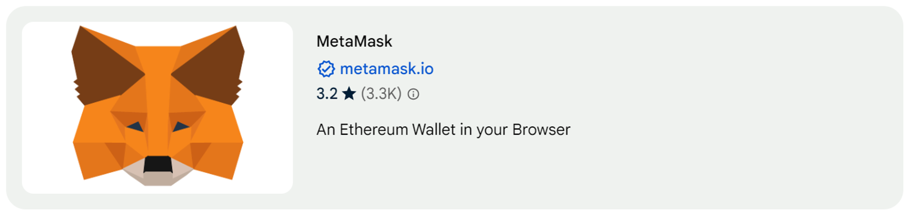
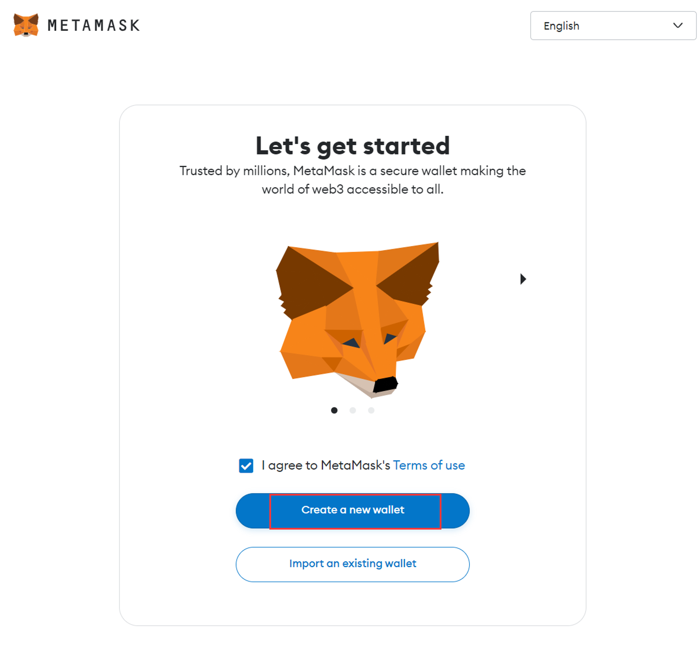

# Content/ MetaMask 初始化

### **安装**

本教程中我们使用Chrome浏览器扩展来安装metamask，这是极为简便的一种方式。

目前这些浏览器都支持metamask的插件，

- Chrome
- Firefox
- Edge
- Brave

或者你也可以访问每个浏览器的扩展商店并搜索 MetaMask 看他是否支持 MetaMask。

> 注意，务必在您的设备上从应用商店下载官方 MetaMask 应用，而非从其他来源下载。外面的 MetaMask 克隆版本经过编程，在您生成助记词之时便会将其记录下来。从而非法获取私钥导致你的数字财产安全受到威胁。
> 

### 创建钱包

在我们下载好后，我们开始创建我们的数字钱包。

在输入账号密码并保存助记词后（这里不方便展示，也请你千万不要随便透露），接下来我们的钱包就创建成功啦。现在，您已经拥有了一个 MetaMask 钱包，并且其中有一个默认账户。

