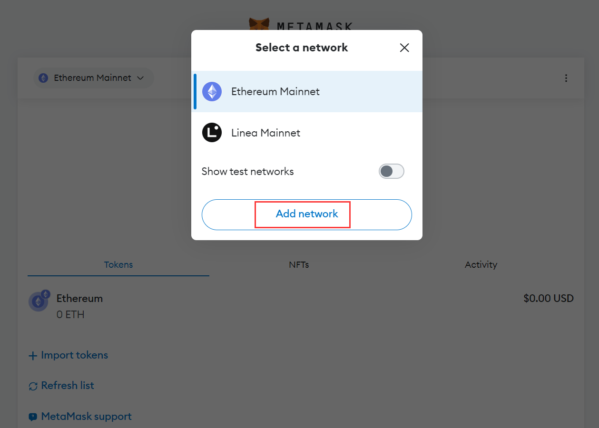
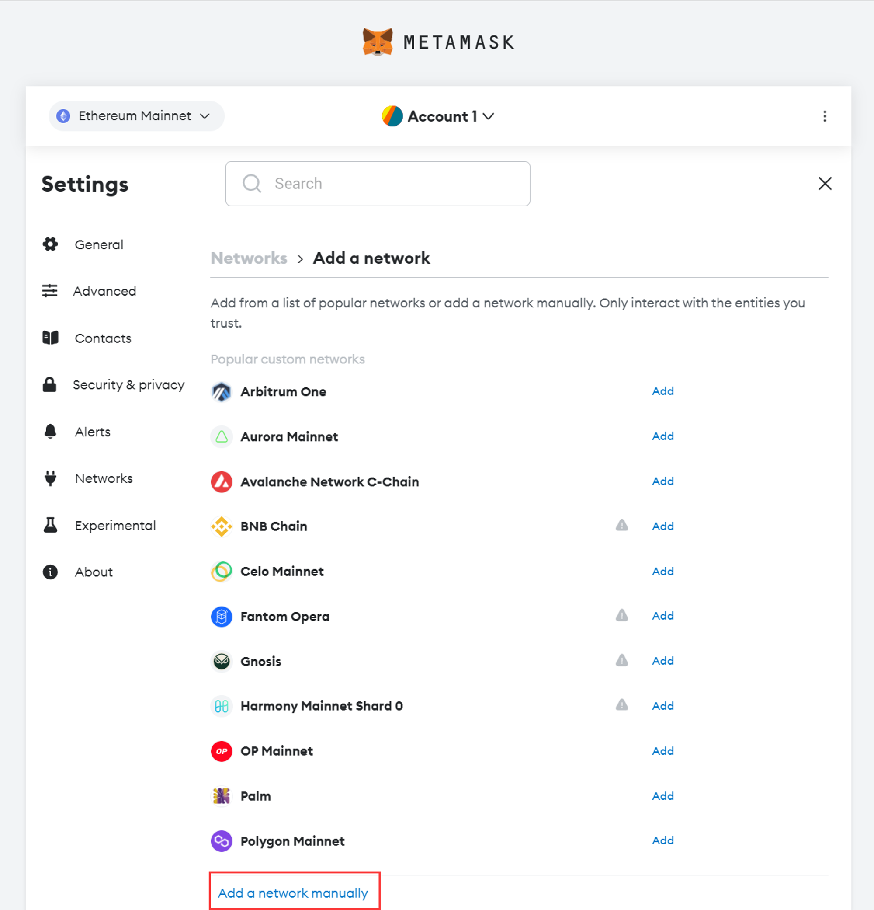
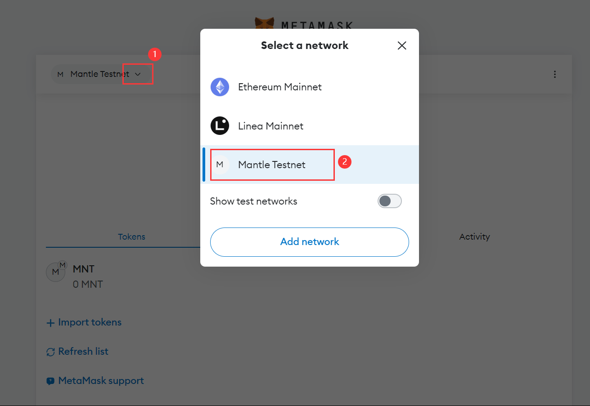
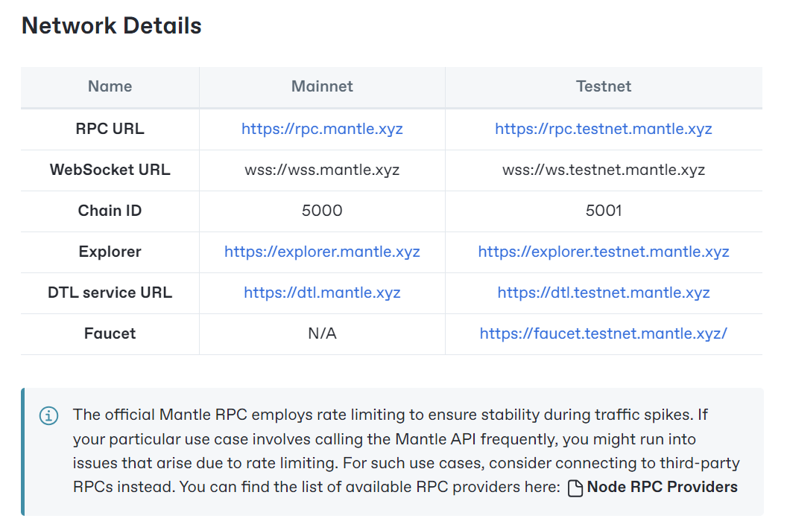

# Content/ 网络配置

除了默认提供的网络，我们还能手动添加一些我们希望与之进行交互的网络。在这里，我们选择了 Mantle 测试网络（Mantle gas 消耗低，交易确认速度快，是一个很不错的选择）。有关网络的配置信息通常可以在该网络的开发者文档或操作指南中找到。Mantle的相关文档在[这里](https://docs.mantle.xyz/network/for-devs/developing-on-mantle)。

让我们开始配置网络吧！

- 网络配置
    1. 在你钱包的主页上，点击屏幕顶部的网络选择器，然后点击“添加网络”：
        
        
        
        
        
    2. 在这里，你应该会看到待添加的热门网络列表（除非已经添加了网络）。点击底部按钮以开始手动添加流程，然后按照提示操作。
        
        
        
    3. 根据 [Mantle 文档](https://docs.mantle.xyz/network/for-devs/developing-on-mantle)中提供的配置信息，填写相应的字段并保存
        
        
        
    4. 执行上述步骤后，下次访问网络选择器时，便能看到自定义的 Mantle 网络了，我们可以在这里进行网络的切换，从主网切换到 Mantle , 后续的操作都将在 Mantle 上进行！

        
        
# Content/Mantle Network Details

