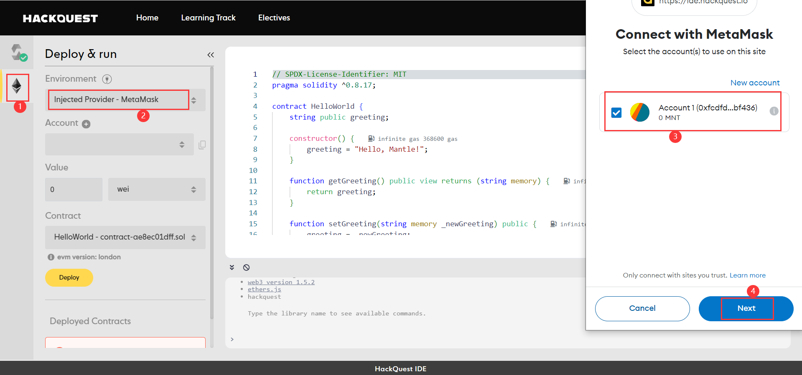
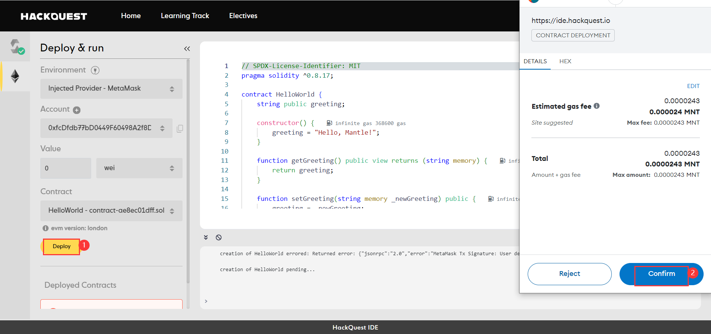
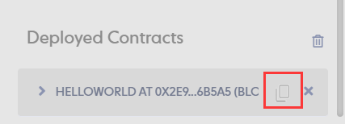
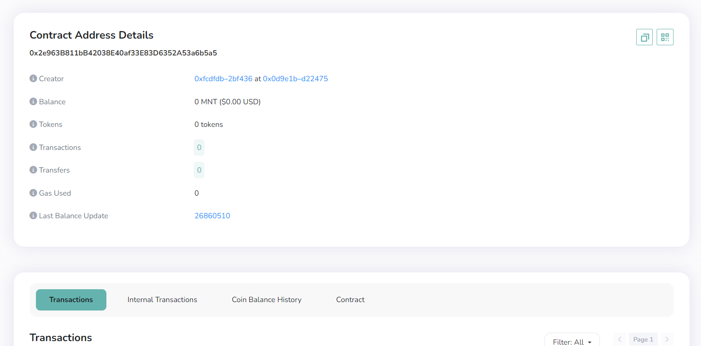

# Content/部署合约

好的！目前我们的钱包有一定余额了，我们可以尝试着使用这些 MNT 来进行一些简单的操作，例如：部署一个智能合约到 Mantle 链上。

通常，关于合约部署有这样几个基本步骤：

- 编写简单的智能合约
    
    > 为了方便演示，我们在这里提供了一份简单的HelloWorld合约。
    > 
- 使用Remix VM本地测试合约
- 本地部署
    1. 编译合约
        
        
        
    2. 使用Remix VM部署合约，这里我们选择 Remix VM(Shanghai)
        
        
        
    3. 测试 ***get*** 函数
        
        
    4. 测试 ***set*** 函数
        
        
        
        
        
- 在Mantle链上部署合约
- 链上部署
    1. 编译合约
        
        
        
    2. 使用 Injected Provider - MetaMask 部署合约，首先我们需要确认将账户连接到我们的网站
        
        
        
    3. 点击部署合约，并确认合约部署交易
        
        
        
- 验证合约的成功部署
- 区块链浏览器验证
    
    恭喜！现在部署成功后，我们就获得了一个真正上链的合约，它将永久运行在区块链上，我们可以使用合约地址在 Mantle 提供的[区块链浏览器](https://explorer.testnet.mantle.xyz/)中查看对应合约信息了！
        
        
        

# Example/示例代码
```solidity
// SPDX-License-Identifier: MIT
pragma solidity ^0.8.17;

contract HelloWorld {
    string public greeting;

    constructor() {
        greeting = "Hello, HackQuest!";
    }

    function getGreeting() public view returns (string memory) {
        return greeting;
    }

    function setGreeting(string memory _newGreeting) public {
        greeting = _newGreeting;
    }
}
```