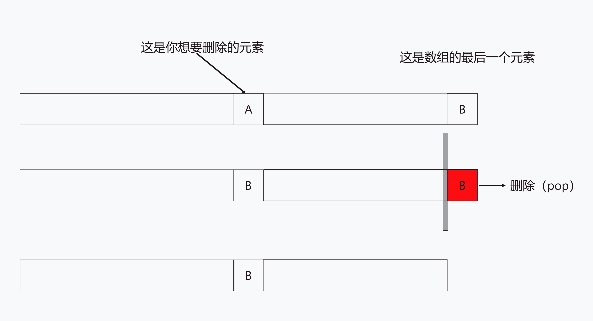

# Content/**移位**

接下来，让我们编写`if`语句内部的逻辑。

首先，我们必须明确，一旦进入`if`语句，就意味着我们在遍历***account***钱包时找到了要删除的***_tokenId***。

现在，我们需要编写在钱包中删除该TokenId的逻辑。

在Solidity中，要删除数组中的一个元素，只能使用`pop`语句，而`pop`语句是删除*数组*的最后一个元素。由于我们无法确定要删除的TokenId在*数组*中的位置，因此这并不是我们想要的操作。

那么，如果我们将要删除的TokenId和*数组*的最后一个元素交换位置，就可以使用`pop`语句删除我们想要删除的TokenId了！

实际上，我们只需要将*数组*的最后一个元素覆盖要删除的TokenId所在的索引位置，而不需要将要删除的TokenId "移动"到*数组*的最后一个位置。

最后使用`pop`语句将*数组*的最后一个元素删除即可。



> 数组的最后一个元素的索引是*arr.length - 1*，因为数组的索引是从*0*开始的。
> 

**Syntax** 

variable

- 提示
    
    ```solidity
    arr[i] = arr[arr.length - 1];
    ```
    

