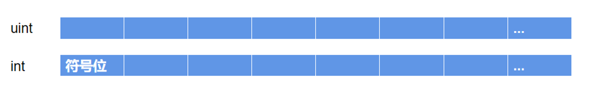

# Content/概念

### Concept

在前面的内容中，我们已经学过一种整数类型int，他是一种*有符号的整型*表示方式，可以表示负数以及正数，而现在我们要学习无符号整型变量uint，无符号整形只能是正整数。

- 比喻
    
    **无符号整型**和**有符号整型**的区别：
    
    想象你正在探险，你有一个计步器记录你移动的步数。计步器可以记录正数（表示向前移动的步数）和零（表示停止不动），但不能记录负数（表示向后移动的步数）。这就好比无符号整型uint，它可以表示正整数和零，但不能表示负数。
    
    现在，想象你有一个高度计，它可以记录相对海平面的海拔高度，包括正数（上升的高度）和负数（下降的深度）。这就类似于有符号整型int，它可以表示正整数，零，以及负整数。
    
- 真实用例
    
    在[ERC20](https://github.com/OpenZeppelin/openzeppelin-contracts/blob/8186c07a83c09046c6fbaa90a035ee47e4d7d785/contracts/token/ERC20/ERC20.sol#L43)合约中，我们使用一个`uint256`类型的变量来记录代币的发行量。
    
    ```solidity
    uint256 private _totalSupply;
    ```
    

### Documentation

我们使用关键字`uint`来定义无符号整型，`int`定义有符号整型

```solidity
//使用关键字uint来定义无符号整型，int定义有符号整型
int ourInteger = -10;
uint outUInt = 1;

//更新整数的常用操作是 **+=** 和 **-=**
int a = 3;
//这与 a = a + 3 相同，首先检索 a 的值，将其加上 3，然后将其分配回 a
a += 3; //a 现在是 6 
a -= 4; //同理，这与 a = a - 4 相同，a 现在是 2 

//我们还可以比较两个数字并返回一个 bool值。
//比较运算符有： **<=**， **<**， **==**， **!=**， **>=**， **>** 。
bool d = 10 > 3; // 因为 10>3，所以 d 将为 true
bool e = 3 <= 3; // e 也将为 true，<= 表示小于等于
```

### FAQ

- 为什么要区分无符号整数和有符号整数?
    
    这是因为在使用相同的内存情况下，*uint*能表示的整数范围比*int*大。因为对于*int*类型最高位用于表示符号，对于*uint*类型我们不需要存储整数的符号(`-` 或 `+`)，所以我们可以有更多的空间来存储实际数字。
    
    

# Example/示例代码

```solidity
pragma solidity ^0.8.4;

contract Book {
    uint bookID; // 无符号整数
    int price; // 有符号整数
}
```
