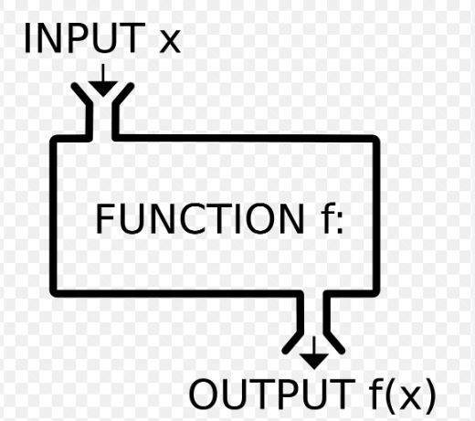

# Content/概念

### **Concept**

现在你已经学习了一些变量类型，但目前我们能做的事情非常有限。

如果你需要多次执行相同的操作，那么每次都要编写相同的代码。这会导致代码**冗长**而**难以维护**。

使用函数就完全不同了。函数可以在不同的代码中多次使用，并避免编写重复的代码。

- 比喻
    
    可以将*函数*视为一个**黑匣子**。给定输入，它将执行一组预定义的计算，并输出某些内容或对你的*变量*进行一些更改。
    
    
    
- 真实用例
    
    在ERC20合约中，我们定义了一个名为***[transfer](https://github.com/OpenZeppelin/openzeppelin-contracts/blob/8186c07a83c09046c6fbaa90a035ee47e4d7d785/contracts/token/ERC20/ERC20.sol#L118)***的函数，每当用户想要发送代币时，他们都会调用这个函数，但他们不知道它到底做了什么，但他们知道他们的余额会减少，而接收者的余额会增加。
    
    ```solidity
    function transfer(address to, uint256 value) public virtual returns (bool) {
        ...  
    }
    ```
    

### Documentation

作为一个黑匣子，我们需要定义它的使用方式，即它的名称、*输入*和*输出*。这是一行代码完成的，我们称之为函数头。

要定义一个*函数*，我们使用关键字`function`，后跟其名称。

```solidity
//一个名为sum的函数
function sum() {
	//函数体
}
```

有一些关键字不能用来命名*函数*，例如，你不能将你的*函数*命名为“***function***”。

<aside>
💡 当定义*函数*时，将*函数*视为黑匣子非常重要：

- 不知道细节
- 不需要知道细节

只考虑为了让*函数*工作而需要传入什么，以及从*函数*中获取的输出是什么。

</aside>

### FAQ

- 什么是函数，为什么需要函数？
    
    *函数*就是把实现某功能的所有的代码打包，每次需要这个功能的时候**不用重复**去写实现这个功能的代码，而是直接调用*函数，*如下代码：
    
    ```solidity
    function name() {
    	//实现某一个功能的的代码
    }
    ```

# Example/示例代码

```solidity
pragma solidity 0.4.24;

contract Function {
	//在这里我们定义了一个名为add的函数
	function add() { }
}
```

