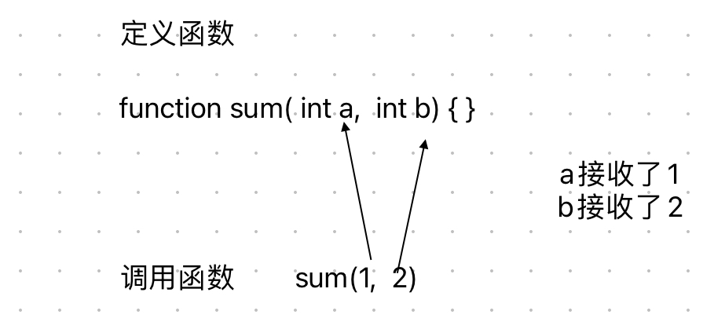

# Content/概念

### Concept

在上一节我们定义了一些函数，并且知道了*函数*就相当于**黑匣子**。

而我们有时候需要给这个黑匣子一些信息，让它来处理这些信息，因此我们引入“**输入参数**”这个概念来表示这些信息。

- 比喻
    
    就像是黑匣子的入口，我们可以通过入口将一些信息传递给黑匣子来处理。
    
- 真实用例
    
    在ERC20合约中，我们可以通过***[balanceOf](https://github.com/OpenZeppelin/openzeppelin-contracts/blob/8186c07a83c09046c6fbaa90a035ee47e4d7d785/contracts/token/ERC20/ERC20.sol#L106C1-L106C1)***函数查询某个地址的代币余额，而要查询的地址就是通过参数传递给函数的。
    
    ```solidity
    function balanceOf(address account) public view virtual returns (uint256) {
        return _balances[account];
    }
    ```
    

### Documentation

要定义一个*函数*的*输入参数*，我们在函数名后的括号中放置它们。

如果我们想要多个参数，则使用`,`进行分隔。

```solidity
//这里有两个输入参数，a 和 b，都是有符号整数 int。
function sum(int a, int b) public {
	//function body 
}
```

### FAQ

- 什么是输入参数？
    
    *输入参数*是在定义*函数*时被指定的一个或多个变量，用于接收调用*函数*时传递进来的值。
    
    
    
    使用不同的*输入参数*，*函数*会返回不同的结果。
    
    例如，如果你正在计算 x+y+10，由于x和y是自变量，那么这两个值应该作为输入参数，而 10 则不是。