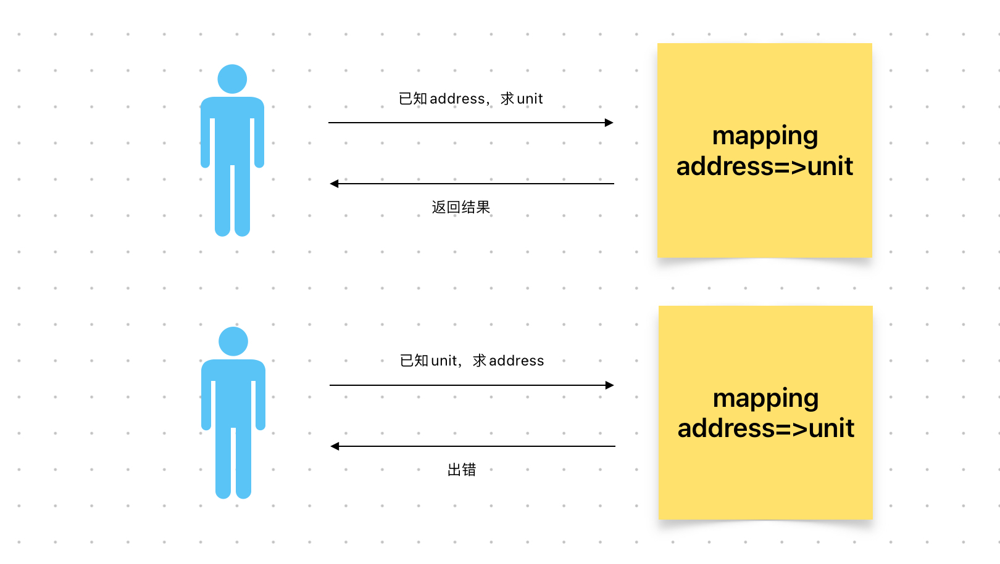

# Content/概念

### Concept

到目前为止，我们已经学习了许多变量类型，包括布尔值、整数和地址。在本节中，我们将学习另一种类型，称为 mapping，它提供了一种以**结构化**方式存储和管理信息的方法。

- 比喻
    
    在Solidity中，mapping是一种用于存储键值对的数据结构，其中键是**唯一**的，并且可以将一个值与一个键相关联。这类似于现实生活中的电话簿，其中每个电话号码都对应一个姓名。
    
- 真实用例
    
    在ERC20合约中，有一个***[_balances](https://github.com/OpenZeppelin/openzeppelin-contracts/blob/8186c07a83c09046c6fbaa90a035ee47e4d7d785/contracts/token/ERC20/ERC20.sol#L39)***映射用来存储地址和余额之间的对应关系。
    
    如果我们想知道某个地址的余额，就可以通过该映射来查询。
    
    ```solidity
    mapping(address => uint256) private _balances;
    ```
    

### Documentation

要定义一个 mapping，我们使用关键字 `mapping`，后跟我们希望建立单向关联的两种类型。最后是名称。

```solidity
mapping(uint => uint) IDToID;
```

### FAQ

- 能更详细的描述mapping吗？
    
    想象你是一家银行。你需要跟踪所有账户（地址）的余额（整数）。
    
    很多时候，你可以查找给定帐户的余额，但你不能查找给定余额的账户。这是一种单向关联。
    
    mapping 提供了两个类型之间的单向关联 —— 在这里，一个是地址，一个是 uint。
    
    ```solidity
    mapping(address => uint) balance;
    ```
    
    在这里，地址称为键（key），uint 是值（value）。我们可以通过键查询值，不能通过值查询键。
    
    

# Example/示例代码

```solidity
pragma solidity ^0.8.4;

contract book {
	//声明一个mapping，名称为owned_book，将地址映射到 uint 类型的值;
	mapping(address => uint) public owned_book;
}
```