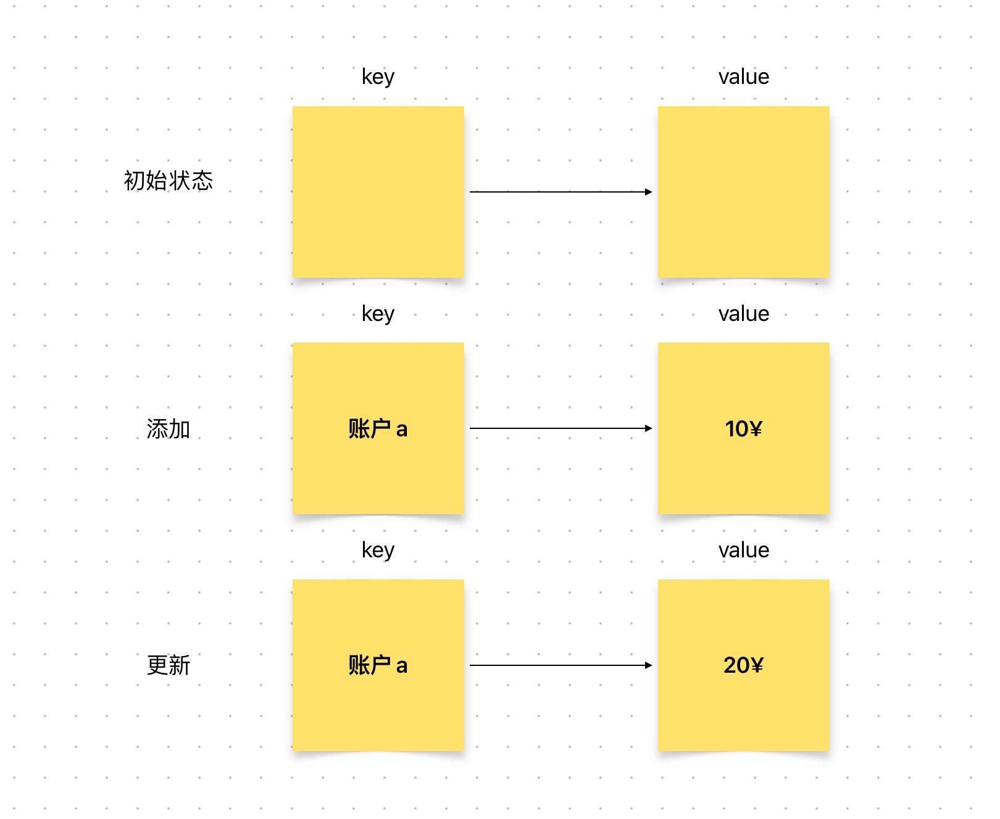

# Content/概念

### Concept

对于整数，我们可以执行加减乘除等操作；对于mapping，我们可以添加、更新、删除和查询。

本节我们将学习如何在mapping当中添加和修改“值”。

- 比喻
    
    上一节中，我们提到mapping就像电话簿，一个人物对应着一个电话号码。
    
    但如果我们有联系人更换了电话号码，我们就需要在电话簿上进行修改。
    
- 真实用例
    
    在ERC20的***[_update](https://github.com/OpenZeppelin/openzeppelin-contracts/blob/8186c07a83c09046c6fbaa90a035ee47e4d7d785/contracts/token/ERC20/ERC20.sol#L255)***函数中，对_balances映射做出了修改。修改了from对应的余额为fromBalance - value。
    
    ```solidity
    function _update(address from, address to, uint256 value) internal virtual {
        _balances[from] = fromBalance - value;
    }
    ```
    

### Documentation

和其他编程语言的映射一样，我们将键放置在`mapping`名称之后的`[]`内。

我们使用与分配变量值相同的语法，使用**`=`**向`mapping`中添加一个键值对。

对于mapping键值的更新，我们也使用相同的语法。

```solidity
balance[address(0x123)] = 10;///这将为地址 0x123 分配一个新值
balance[address(0x123)] = 20;//这将把值从 10 更新为 20
```

在这里，我们将值分配给由`[]`指定的键。

<aside>
💡 其实，mapping的添加也相当于更新，只不过是将mapping的默认值更新为要添加的值。

</aside>

### FAQ

- 添加和更新的区别？
    
    他们其实没有本质的区别，都是修改key存储位置对应的value。
    

# Example/示例代码

```solidity
pragma solidity ^0.8.4;

contract book {
	//声明一个私有映射，将地址映射到一个 uint 值，表示该地址拥有的书籍ID
	mapping(address => uint) private owned_book;
	//声明一个名为 "add_book" 的函数，它接受一个 uint 类型的 bookID 作为输入，并且是公开可访问的
	function add_book(uint bookID) public {
		//将书籍ID添加到映射中，使用硬编码的地址 0x123 作为键
		owned_book[address(0x123)] = bookID;
	}
}
```
