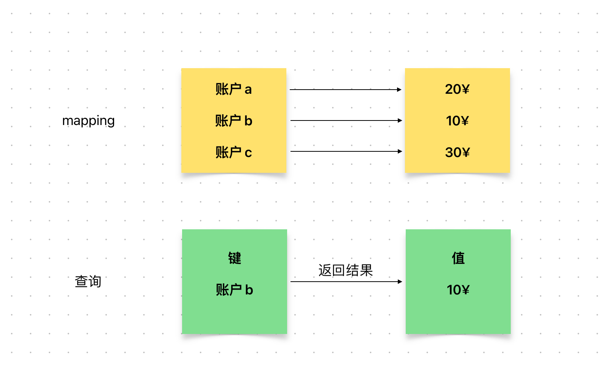

# Content/概念

### Concept

上一节我们学习了mapping的添加和更新操作，本节我们将学习*mapping*的另一个操作：**查找**。

- 比喻
    
    *mapping*就像是电话簿，那么我们就需要在电话簿中通过姓名查找他的电话号码
    
- 真实用例
    
    还是以ERC20当中的[***balanceOf***](https://github.com/OpenZeppelin/openzeppelin-contracts/blob/8186c07a83c09046c6fbaa90a035ee47e4d7d785/contracts/token/ERC20/ERC20.sol#L107)函数作为用例，_balances是一个映射，我们可以通过映射的键***account***来查找其对应的值。
    
    ```solidity
    function balanceOf(address account) public view virtual returns (uint256) {
        return _balances[account];
    }
    ```
    

### Documentation

要查询映射中某个键对应的值，只需在`mapping`名称后面加上`[]`，`[]`里面放入要查询的键即可。

```solidity
uint b = balance[address(0x123)];
```

<aside>
💡 如果要查询的键不存在，则会返回这个值类型的默认值。
例如uint的默认值是0，bool的默认值是false。

</aside>

### FAQ

- 我还是没太懂怎么在映射当中进行查询
    
    我们为一个键分配了一个值之后，我们可以使用这个键来查找它对应的值。
    
    ```solidity
    valueType value = mappingName[key];
    ```
    
    例如，我们在银行中可以根据自己的账户查询出自己账户对应的余额。
    
    
# Example/示例代码

```solidity
pragma solidity ^0.8.4;

contract book {
	mapping(address => uint) private owned_book;

	function add_book(address owner, uint bookID) public {
		owned_book[owner] = bookID;
	}
	//获取书籍函数，根据地址获取对应的书籍 ID
	function get_book(address owner) public view returns(uint){
		return owned_book[owner];
	}
}
```

