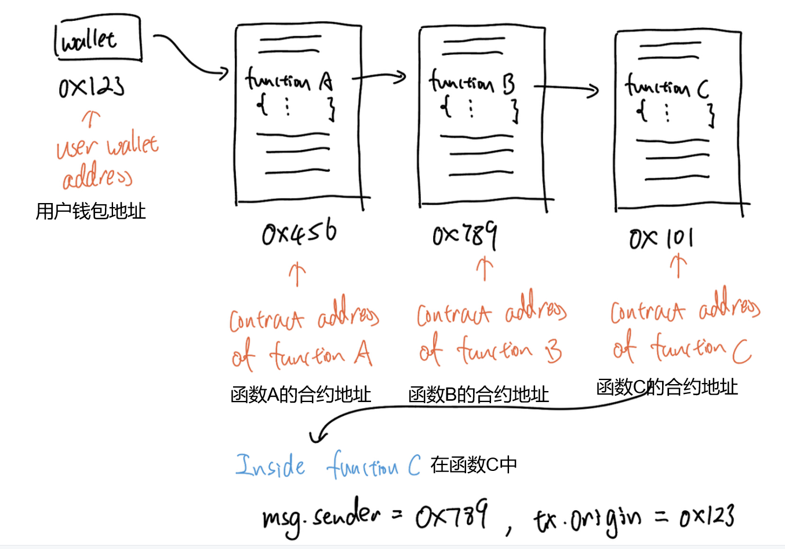

# Content/概念

### Concept

最后，本节将介绍一个特殊变量msg.sender。

msg.sender可以获取本次调用的调用者地址。

- 比喻
    
    就像我们在接收消息时，有需求知道发送消息的人是谁一样。
    
    在函数的调用中，我们也需要知道此次调用的调用者是谁。
    
- 真实用例
    
    还是以上一节中的***CompTimelock***合约中***[queueTransaction](https://github.com/OpenZeppelin/openzeppelin-contracts/blob/9ef69c03d13230aeff24d91cb54c9d24c4de7c8b/contracts/mocks/compound/CompTimelock.sol#L102-L120)***函数使用了`msg.sender`来查询此次调用的调用者。
    
    ```solidity
    function queueTransaction(
        address target,
        uint256 value,
        string memory signature,
        bytes memory data,
        uint256 eta
    ) public returns (bytes32) {
        require(msg.sender == admin, "Timelock::queueTransaction: Call must come from admin.");
        ...
    }
    ```
    

### Documentation

要使用`msg.sender`，我们不需要定义它。它在函数中处处可用，代表函数的调用者。

```solidity
function a() {
		//这里 msg.sender 没有定义为状态变量
		//也不作为参数传入，我们可以直接使用它
		address a = msg.sender;
}
```

### FAQ

- msg.sender与tx.origin的区别
    
    可以想象一个场景，我这个用户调用了函数A，则A又调用了B，B又调用了C。A，B，C是三个不同合约中的函数。我的钱包地址为0x123。
    
    对于函数C，`msg.sender`是函数B的合约地址，而`tx.origin`则是0x123，也就是我的钱包地址，因为`tx.origin`表示最初初始化整个调用链的账户地址。
    
    
    
    <aside>
    💡 关于特殊变量的完整列表，请查看https://docs.soliditylang.org/en/v0.8.19/units-and-global-variables.html#block-and-transaction-properties
    
    </aside>
    
- 更详细的讲一下msg.sender吧
    
    我们前面说过每个函数都需要被调用才能执行，那么我们怎么知道谁是调用者呢？
    
    `msg.sender`指的是函数的直接调用者。
    
    假如有个函数如下：
    
    ```solidity
    function myFunction() public { 
    		address caller = msg.sender;
    }
    ```
    
    这里的`msg.sender`即为调用myFunction函数的地址。
    

# Example/示例代码

```solidity
pragma solidity ^0.8.4;

contract VendingMachine {
    address public owner = address(0x123);

    function buy(uint amount) public {
				//我们将在下一课中解释msg.sender
        require(msg.sender == owner, "Not authorized.");
        // 执行购买操作。
    }
}
```
