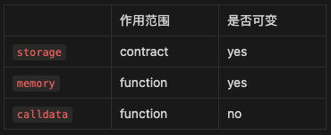

# Content/概念

### Concept

在上一课中，我们提到引用类型是指变量存储的是数据的地址。这个地址在哪里呢？

每种引用类型都有一个数据位置，指明变量值应该存储在哪里。Solidity 提供3种类型的数据位置：**storage**、**memory** 和 **calldata**。

而storage则是作用于合约的存储结构。



- 比喻
    
    storage就像共享文档，任何对storage的改动，都会被所有人同步更新。
    
- 真实用例
    
    在ERC20中，***_totalSupply***就是一个存储在storage的变量，所有函数都可以访问该变量。
    
    同时在OpenZepplin的***[GovernorUpgradeable](https://github.com/OpenZeppelin/openzeppelin-contracts/blob/9ef69c03d13230aeff24d91cb54c9d24c4de7c8b/contracts/governance/Governor.sol#L139)***合约中，***state***函数也先将获取到的proposal定义为storage变量，这样对proposal的修改将会同步到合约的状态变量中。
    
    <aside>
    💡 如果申明为memory则不会对合约状态变量产生影响，这会在下一节中讲到。
    
    </aside>
    
    ```solidity
    uint256 private _totalSupply;
    
    //GovernorUpgradeable.sol L143
    function state(uint256 proposalId) public view virtual override returns (ProposalState) {
        ProposalCore storage proposal = _proposals[proposalId];
    }
    ```
    

### Documentation

所有的状态变量都在 storage 中

```solidity
//这个字符串状态变量存储在 storage 中
string str;

function a() {
	//函数体
}
```

<aside>
💡 状态变量默认存储在storage，我们不需要显示指定。

</aside>

### FAQ

- 究竟什么是 storage？
    
    这个位置用于存储合约的状态变量。存储在此位置的数据被持久化存储在以太坊区块链上，因此消耗的gas更大。
    
    
    
- 何时使用 storage？
    
    任何想要**永久存储**在以太坊区块链上的内容都应该存储在 storage 中。
    
    ```solidity
    contract MyContract {
        //在函数外定义的状态变量默认存储在storage中
    	  mapping (int => bool) b; 
    }
    ```
    

# Example/示例代码

```solidity
pragma solidity ^0.8.4;

contract storageExample {
	//这个字符串状态变量存储在 storage 中
	string name = "hello";
	function update() public {
		name = "hello~";
	}
}
```
