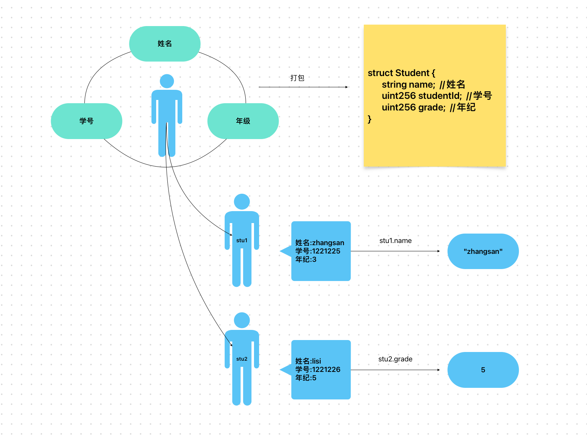

# Content/概念

### Concept

在我们讨论了如何初始化结构体之后，我们需要知道该怎么访问一个结构体变量。

一个结构体通常存储了很多信息，我们想要从中精准的找到我们想要的信息，那么如何查找呢？



- 比喻
    
    上一节中我们提到学生是一个结构体，那么如果我们想要知道张三这个“结构体”的身高，就需要在结构体当中查询该信息。
    
- 真实用例
    
    同样在***GovernorStorage***合约当中，***[execute](https://github.com/OpenZeppelin/openzeppelin-contracts-upgradeable/blob/7d7ad99dee371e0ee042e2999aaf43941dea1513/contracts/governance/extensions/GovernorStorageUpgradeable.sol#L61)***函数通过***details.targets***，***details.values***等方式获取了***details***结构体的各个属性。
    
    ```solidity
    function execute(uint256 proposalId) public payable virtual {
        // here, using storage is more efficient than memory
        ProposalDetails storage details = _proposalDetails[proposalId];
        execute(details.targets, details.values, details.calldatas, details.descriptionHash);
    }
    ```
    

### Documentation

要想访问一个结构体，你需要使用`StructName.PropertyName`的形式访问，这个和Java中类的访问方式是一样的。

```solidity
//这里我们访问了***student***结构体中的***name***属性，并将其赋值给***name***变量。
string name = student.name;
```

### FAQ

- 什么时候会访问结构体？
    
    一般情况下，结构体都存储在一个**数组**或**映射**当中，当你想要获取某个实例的属性时，你就需要访问这个结构体的这个属性。
    
    例如你想知道学号为01的学生的姓名，你就可以去访问该学生的结构体实例对应的姓名属性。

# Example/示例代码

```solidity
// SPDX-License-Identifier: MIT
pragma solidity ^0.8.0;

contract Example {
  struct Student {
    string name;
    uint256 studentId;
    uint256 grade;
  }
  //我们在这个函数中先初始化了一个名为student的实例
  //随后使用实例名+"."+属性名的形式访问了name属性
  function testUpdate() public pure returns(string memory name) {
    Student memory student = Student("Alice", 1, 3);
    name = student.name;
  }
}
```
