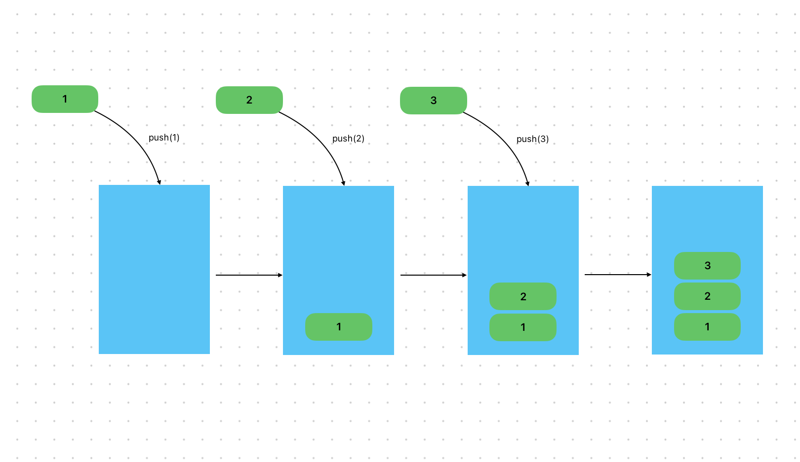

# Content/概念

### Concept

在上一节中，我们学到了如何定义一个动态数组。而在这章中，你将会学习一个向数组里添加元素的方式-push。

当处理动态数组时，使用push是一种常见的方式。它允许我们在数组的末尾添加新的元素，而无需事先知道数组的大小或指定索引。



- 比喻
    
    类比到班级里的学生，使用push函数就相当于向班级中添加一名新的学生，同时新的学生会被添加到班级最后一个位置上。
    
- 真实用例
    
    同样在***GovernorStorage***合约中，***[_propose](https://github.com/OpenZeppelin/openzeppelin-contracts-upgradeable/blob/7d7ad99dee371e0ee042e2999aaf43941dea1513/contracts/governance/extensions/GovernorStorageUpgradeable.sol#L45)***函数用于提交提案，于是我们使用***_proposalIds*`.**push`的方式将此提案的***proposalId***存储到数组中。
    
    ```solidity
    function _propose(
        address[] memory targets,
        uint256[] memory values,
        bytes[] memory calldatas,
        string memory description,
        address proposer
    ) internal virtual override returns (uint256) {
        uint256 proposalId = super._propose(targets, values, calldatas, description, proposer);
    
        // store
        _proposalIds.push(proposalId);
        ...
    }
    ```
    

### Documentation

为了向动态数组的末尾添加新的元素，我们需要使用`ArrayName.push()`，括号中为要添加的元素。

```solidity
//在这里我们向名为***arr***的数组的末尾添加了一个值“*1*”。
arr.push(1);
```

<aside>
💡 push只允许我们在数组的末尾添加新的元素，而且注意一次只能push一个元素

</aside>

### FAQ

- 无论什么数组都可以使用push吗？
    
    只有**变长**的**storage**数组有push()方法。

# Example/示例代码

```solidity
pragma solidity ^0.8.0;

contract Example {
  uint256[] public nums;
  //这里我们像nums数组的末尾依次push了元素1，2，3
  //执行完后该数组的结构应该为[1,2,3]
  function testPush() public {
    nums.push(1);
    nums.push(2);
    nums.push(3);
  }
}
```
