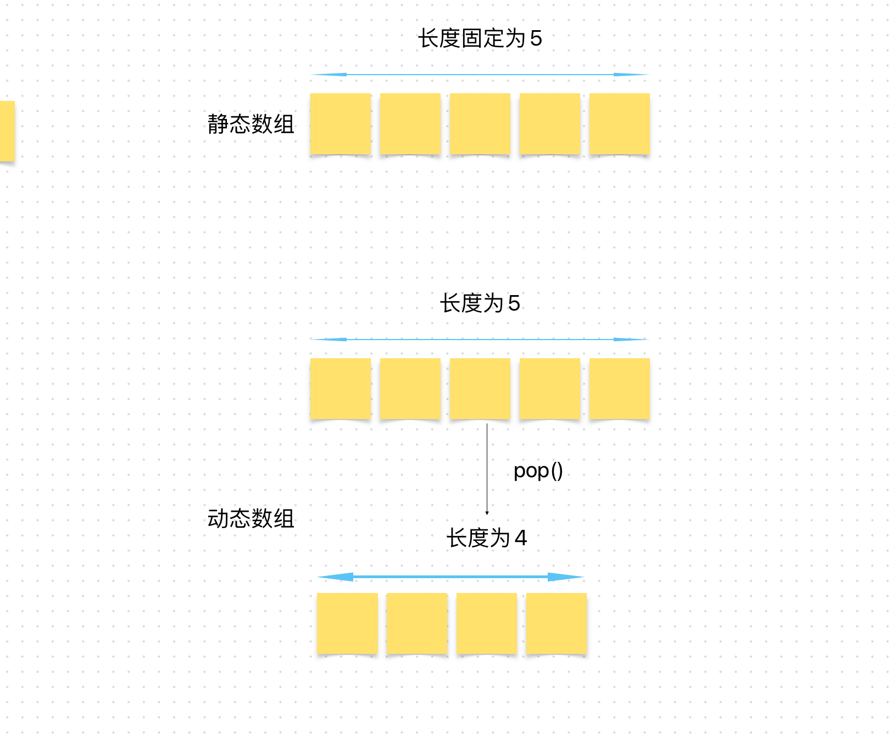

# Content/概念

### Concept

在前面的章节中，我们学习了动态数组的定义以及增添删除的方式。

在这章中，你将会学习如何查看动态数组的**长度**，在Solidity中，数组的**长度**是指数组中元素的数量。

- 比喻
    
    类比到班级里的学生，可以将班级看作是一个数组，而学生就是数组中的元素。班级中学生的数量就是这个数组的长度。
    
- 真实用例
    
    在OpenZepplin的***ERC721Enumerable***合约中，***_allTokens***数组记录了所有铸造完成的NFT地址，而***[totalSupply()](https://github.com/OpenZeppelin/openzeppelin-contracts/blob/9ef69c03d13230aeff24d91cb54c9d24c4de7c8b/contracts/token/ERC721/extensions/ERC721Enumerable.sol#L57)***函数通过获取***_allTokens***数组的**长度**来获取当前NFT的发行总量。
    
    ```solidity
    uint256[] private _allTokens;
    
    function totalSupply() public view virtual returns (uint256) {
        return _allTokens.length;
    }
    ```
    

### Documentation

为了获取动态数组的长度，我们使用`length`关键字。只需要在数组名字后加上`.length`即可。

```solidity
uint256 len = arr.length;
```

在这里我们获取了一个名为***arr***的数组的数组长度，并将其赋值给***len***变量。

<aside>
💡 数组的长度是用 *uint256* 类型来存储的。

</aside>

### FAQ

- 动态数组的静态数组的length各有什么特点？
    
    对于静态数组，其**长度**在声明时被指定且不可修改；而对于动态数组，其**长度**可以在运行时进行调整。
    
    
    
- 为什么要查看数组的长度？
    
    因为它允许我们获取数组中当前存储的元素数量，获取到数组**长度**后我们就可以将该值作为循环条件，从而确保我们只访问实际存在的元素，避免访问超出范围的索引。
    
    同时我们可以通过数组**长度**是否为零，来确定数组是否为空。

# Example/示例代码

```solidity
pragma solidity ^0.8.0;

contract Example {

  uint256[] public nums;

  function testPush() public {
    nums.push(1);
    nums.push(2);
    nums.push(3);
    nums.pop();
  }
  //这里定义了一个getLen函数，该函数会返回nums数的数组长度。
  function getLen() public view returns(uint256) {
    return nums.length;
  }
}
```