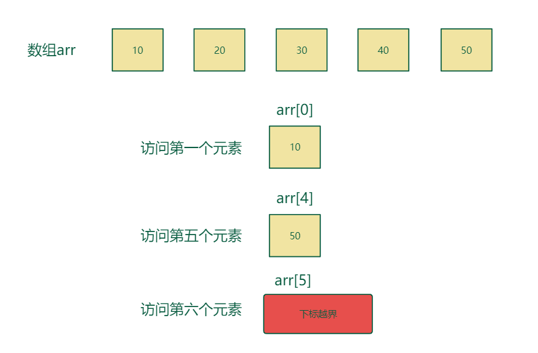

# Content/概念

### Concept

在了解完动态数组的基本操作和属性后，让我们来学习如何访问数组的元素。

在此之前我们有必要了解**数组下标**这个信息。**数组下标**从*0*开始，到数组长度减*1*结束。下标为 *0* 的元素是数组中的第一个元素，下标为 *1* 的元素是数组中的第二个元素，以此类推。



- 比喻
    
    还是以学生举例，假设一个班级有 30 个学生，可以使用一个长度为 30 的数组来表示这些学生，数组的**下标**从 0 到 29，依次对应每个学生。
    
- 真实用例
    
    同样在***ERC721Enumerable***合约中，我们可以通过***[tokenByIndex()](https://github.com/OpenZeppelin/openzeppelin-contracts/blob/9ef69c03d13230aeff24d91cb54c9d24c4de7c8b/contracts/token/ERC721/extensions/ERC721Enumerable.sol#L67)***函数在***_allTokens***数组中找到对应index的token信息。
    
    ```solidity
    uint256[] private _allTokens;
    function tokenByIndex(uint256 index) public view virtual returns (uint256) {
        ...
        return _allTokens[index];
    }
    ```
    

### Documentation

为了获取动态数组元素，我们需要访问数组，使用`数组名`+`[index]`的方式。

```solidity
uint256 num = arr[10];
```

在这里我们获取了一个名为***arr***的数组的*10*号索引，也就是第十一个元素，并将其赋值给***num***变量。

<aside>
💡 在访问动态数组元素时需要先检查数组的长度是否足够，否则也会导致数组越界异常。可以使用 `length` 获取当前数组的长度。

</aside>

### FAQ

- 什么时候会访问数组元素？
    1. 当我们需要对数组中的元素执行某些计算、逻辑或操作时，就需要访问数组元素。
    2. 在某些情况下，我们可能需要将数组元素输出或显示给用户。

# Example/示例代码

```solidity
pragma solidity ^0.8.0;

contract Example {
  uint256[] public nums;

  function testPush() public {
    nums.push(1);
    nums.push(2);
    nums.push(3);
  }
  //这里定义了一个getNum函数，该函数会返回nums数组第index个索引的元素。
  function getNum(uint256 index) public view returns(uint256) {
    return nums[index];
  }
}
```
