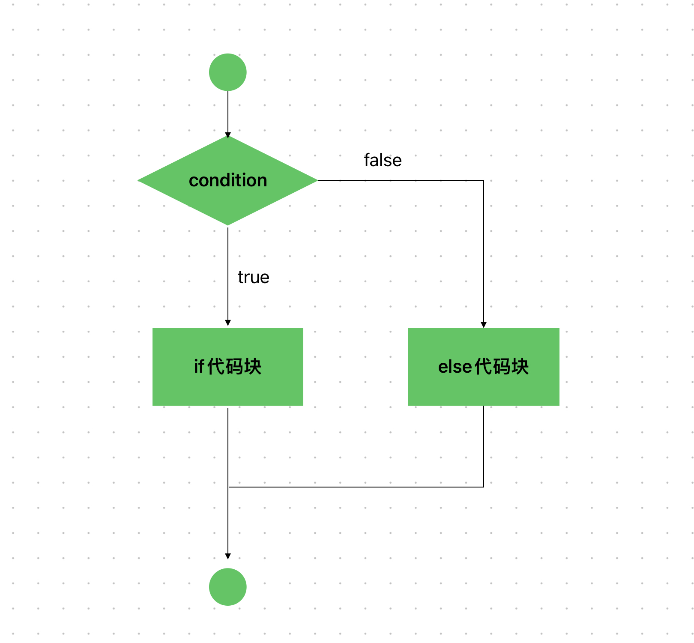

# Content/概念

### Concept

Solidity包含了一些常见的流程控制结构，这些结构用于在程序执行期间对代码的执行进行控制。

在这一节中，我们将介绍流程控制中的if-else 语句。

if-else 语句允许对代码片段进行有条件的执行，它允许根据某个条件的真假来执行不同的代码块。

```solidity
if (condition) {
  // 在条件为真时要执行的代码
} else {
  // 在条件为假时要执行的代码
}
```



- 比喻
    
    我想买一本书。 如果价格低于10美元，我会买下这本书，不然我不会买。 if 允许程序根据某些条件做出决定。 在购买书籍的情况下，程序根据书籍的价格决定是否执行购买。
    
    ```solidity
    if (price <10){
    	//buy the book
    } else{
    	//give up 
    }
    ```
    
- 真实用例
    
    继续我们之前关于 ERC20 合约的讨论，让我们更深入地研究一下 if-else 语句是如何被采用和使用的。
    
    在ERC20 合约中，if-else语句在处理代币转移过程中的各种场景中发挥着关键作用。 其中一个实例位于 ***[_update](https://github.com/OpenZeppelin/openzeppelin-contracts/blob/9ef69c03d13230aeff24d91cb54c9d24c4de7c8b/contracts/token/ERC20/ERC20.sol#L245C9-L245C34)*** *函数中 ，其中*if-else语句用于检查***from*或*to***地址是否为0地址，然后进行相应的代币转账处理。
    
    ```solidity
    function _update(address from, address to, uint256 value) internal virtual {
        if (from == address(0)) {
            _totalSupply += value;
        } else {
            uint256 fromBalance = _balances[from];
            if (fromBalance < value) {
                revert ERC20InsufficientBalance(from, fromBalance, value);
            }
            unchecked {
                _balances[from] = fromBalance - value;
            }
        }
    
        if (to == address(0)) {
            unchecked {
                _totalSupply -= value;
            }
        } else {
            unchecked {
                _balances[to] += value;
            }
        }
    
        emit Transfer(from, to, value);
    }
    ```
    
    在此函数中，if-else语句用于检查***from***地址是否为0地址，这表示进行代币铸造操作。 如果是，则代币的总供应量增加指定值。 类似地，if-else语句用于检查***to***地址是否为0地址，表示烧毁操作。 如果是，则代币的总供应量减少指定值。
    
    这个真实的用例演示了如何在 Solidity 中使用 if-else 语句来处理代币传输、铸造和销毁期间的不同场景和条件。
    

### Documentation

使用 `if` 关键字定义 if 语句，后面跟着用括号`()`括起来的条件，然后是用`{}`括起来的代码块。如果条件为假，将跳过该代码块。

```solidity
if (value == 10) {
  // 当 value 为 10 时执行的代码
} else if (value == 20) {
  //else if用于在if条件不被满足时添加多个条件进行检查。
  //如果之前的if条件未被满足，则将检查下一个else if条件，并在其中找到第一个满足条件的代码块进行执行。
  
  // 当 value 为 20 时执行的代码
} else if (value == 30) {
  // 当 value 为 30 时执行的代码
} else {
  //else是if语句的可选部分，用于指定当if条件为false时要执行的代码块。
  //如果if条件不被满足，则else语句中的代码块将被执行。

  // 当 value 都不满足时执行的代码
}
```

### FAQ

- `if`可以套在`if`里面吗？
    
    可以的。
    
    ```cpp
    if(a) {
    		if(b){
    			//执行逻辑
    		}
    		else {
    			//执行逻辑
    		}
    }
    ```

# Example/示例代码

```solidity
// SPDX-License-Identifier: MIT
pragma solidity ^0.8.0;

contract IfElseExample {
  uint value = 10;
  //检查变量value是否等于10。
  //如果是，它返回字符串"Value is equal to 10"
  //否则它返回字符串"Value is not equal to 10"。
  function checkValue() public view returns (string memory) {
    if (value == 10) {
      return "Value is equal to 10";
    } else {
      return "Value is not equal to 10";
    }
  }
}
```
