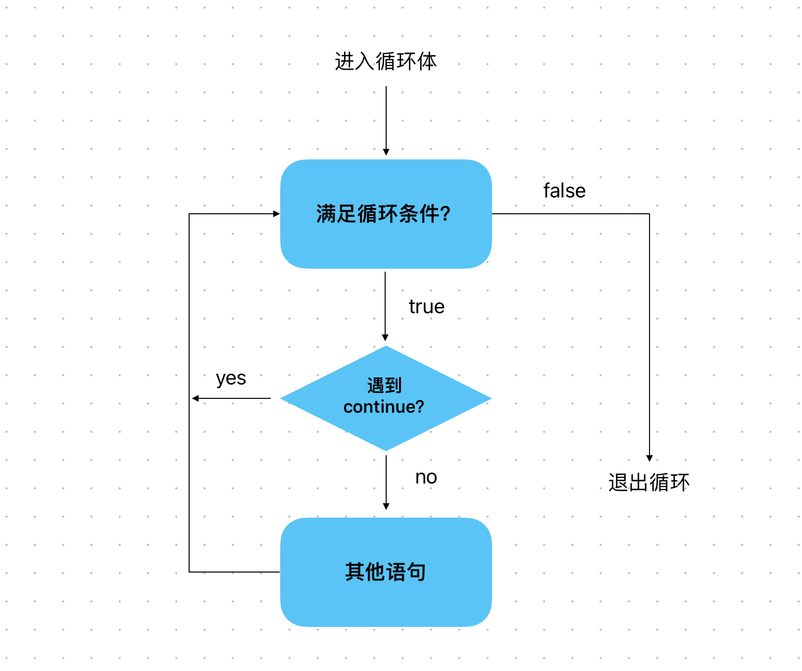

# Content/概念

### Concept

上节课中我们讲到了*不可变量*，现在让我们跳到*循环*。

在之前的课程中，我们学习了`if`、`for`、`while`和`do while`。在本节中，我们将学习`continue` 语句。

*continue*语句是一种用于控制循环行为的语句。当程序执行到continue语句时，会跳过当前循环中剩余的代码，并进入下一次循环的迭代。



- 比喻
    
    假设我们想要买多本书，现在要计算书籍的总价格，我们需要遍历每一本书并将价格累加起来。
    
    然而，我不想购买价格为*13*的书。这个数字对我来说不吉利，所以如果价格是*13*，我希望跳过该书并继续下一本书。这时就可以使用continue语句来跳过此次购买。
    
- 真实用例
    
    我们实现了一个函数，可以把数组中所有的偶数提取出来到新的数组。
    
    ```solidity
    function processEvenNumbers(uint[] memory numbers) public pure returns (uint[] memory) {
            uint[] memory evenNumbers = new uint[](numbers.length);
            uint evenCount = 0;
    
            for (uint i = 0; i < numbers.length; i++) {
                if (numbers[i] % 2 != 0) {
                    continue; //跳过奇数
                }
    
                evenNumbers[evenCount] = numbers[i];
                evenCount++;
            }
    
            assembly { mstore(evenNumbers, evenCount) }
            return evenNumbers;
        }
    ```
    
    与此同时，也可以参考[Solidity By Example](https://solidity-by-example.org/loop/)。
    

### Documentation

使用 `continue` 可以跳过当前迭代的剩余代码，并立即开始下一次迭代的条件检查。

```solidity
for (int a = 0; a < 10; a++) {
  if (a == 5) {
    continue;
  }
  //如果 a 不等于 5，执行其他操作
}
```

### FAQ

- continue一般在什么时候用
    
    *continue*普遍用于循环语句中，用于跳过该次执行，从而继续执行循环的下一步。

# Example/示例代码

```solidity
// SPDX-License-Identifier: GPL-3.0
pragma solidity ^0.8.4;
contract Example {
  uint[] prices = [1,2,13,4];

  function countPrice() public view returns(uint) {
    uint totalPrice = 0;

    for (uint i = 0; i < prices.length; i++) {
      if (prices[i] == 13) {
        continue;
      }
      totalPrice += prices[i];
    }

    return totalPrice;
  }
}
```
