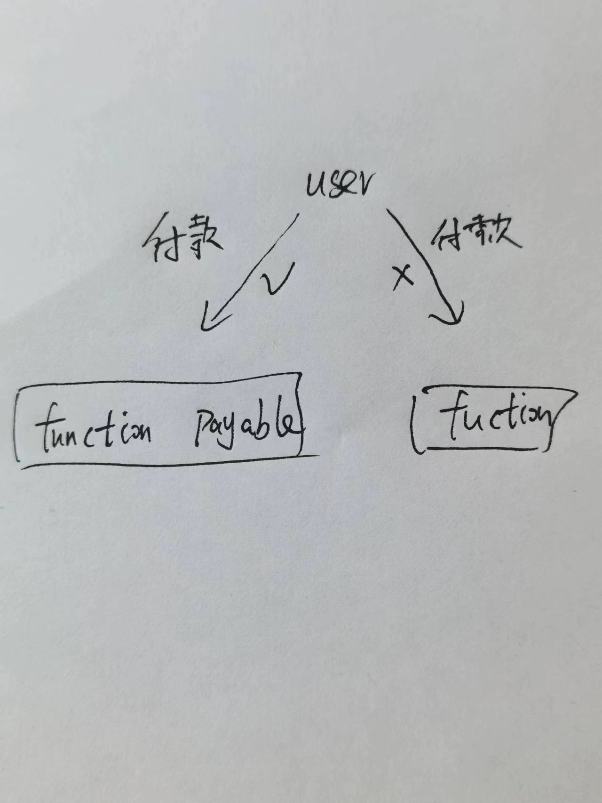
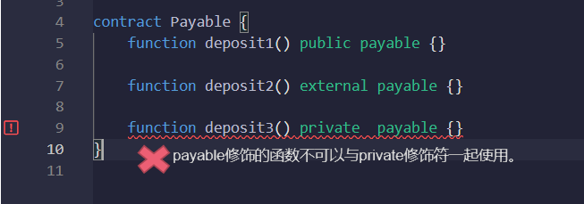

# Content/概念

### Concept

在这一节中，我们将学习函数另一个关键字：**payable**，它表示该函数可以接收以太币（ETH）。

通常情况下，智能合约是不会接收任何以太币。如果你希望某个函数能够接收以太币，可以使用*payable*修饰符将其标记为可支付的。这样，其他人就可以向该函数发送以太币作为交易。



- 比喻
    
    在一个商店内，收银台是唯一一个可以接收并处理客户款项的地方。货架、顾客服务台或者试衣间并不能直接处理款项。这与 Solidity 中的 *payable* 修饰符有相似之处。
    
    因此，在这个比喻中，收银台就像一个标有 *payable* 修饰符的函数，是专门用来接收和处理款项的。其他没有 *payable* 修饰符的函数就像商店内不能处理款项的其他区域。
    
- 真实用例
    
    在OpenZepplin的[***ERC2771Forwarder***](https://github.com/OpenZeppelin/openzeppelin-contracts/blob/9ef69c03d13230aeff24d91cb54c9d24c4de7c8b/contracts/metatx/ERC2771Forwarder.sol#L162C27-L162C27)合约中，`executeBatch`使用payable修饰，证明该函数可能需要传入ETH进行调用。
    
    ```solidity
    function executeBatch(
        ForwardRequestData[] calldata requests,
        address payable refundReceiver
    ) public payable virtual {
    ```
    

### Documentation

在函数名和函数参数后，使用`payable`关键字可以使该函数成为一个可支付函数。

```solidity
//定义了一个可支付函数receivePayment()。
function receivePayment() payable public { }
```

### FAQ

- 什么函数可以使用payable？
    
    只有`public`和`external`的函数支持*payable*修饰。因为如果函数在合约外部不可见的话，用户就无法调用函数，也就自然无法给支付以太给函数。
    

# Example/示例代码

```solidity
pragma solidity ^0.8.0;

contract PaymentContract {
  // 定义一个接收ETH的支付函数
  function receivePayment() payable public returns (uint256) {
    // 在这里编写逻辑来处理接收到的以太币
    // ...
    return msg.value; //返回值为调用者附加的ETH大小
  }
}
```
