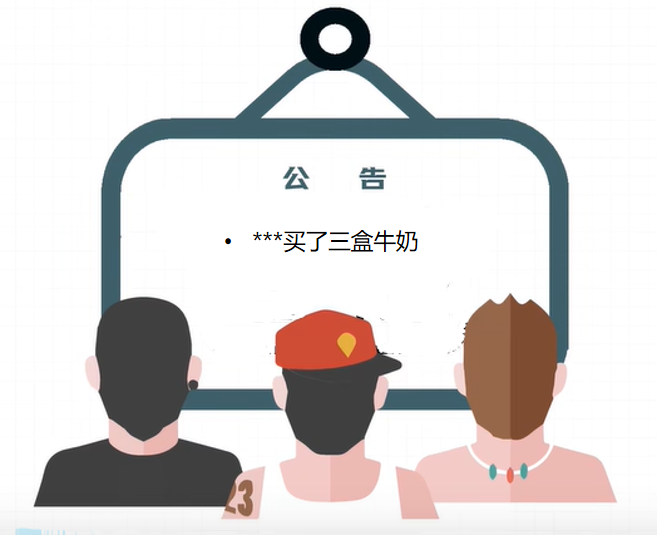

# Content/概念

### Concept

在上一节中，我们学习了事件的定义，那么接下来，就让我们来学习事件是怎么广播的吧。

事件本身只是一个定义或声明，它规定了哪些信息可以被记录或广播。但仅仅定义事件并不足以让其他人或系统知道某件事已经发生了。

在 Solidity 中，要广播一个事件，你需要使用 `emit` 关键字。`emit` 用于初始化事件，并根据事件的定义设置所有需要的信息，然后广播这个事件。这样，所有订阅了该事件的人或系统就会收到通知。

- 比喻
    
    就像我们买了东西，并且我们希望所有人都知道我们已经拥有了它，这时我们就需要广播。
    
    
    
- 真实用例
    
    在新版的ERC20中，_***[update](https://github.com/OpenZeppelin/openzeppelin-contracts/blob/9ef69c03d13230aeff24d91cb54c9d24c4de7c8b/contracts/token/ERC20/ERC20.sol#L244C20-L244C20)***函数用于在转账时修改账户信息，而所有功能完成后，使用*emit*提交了***Transfer***事件，告诉区块链中的所有人这笔交易完成了。
    
    ```solidity
    function _update(address from, address to, uint256 value) internal virtual {
        ...
        emit Transfer(from, to, value);
    }
    ```
    

### Documentation

提交事件使用`emit`关键字，其后跟事件名和参数即可。

```solidity
//在这里我们提交了一个名为***MessageSent***的事件，参数分别为msg.sender和message。
emit MessageSent(msg.sender, message);
```

### FAQ

- 在哪里可以看到提交的事件？
    
    当提交事件时，会触发参数存储到交易的日志中，事件的参数存放在交易日志里。这些日志与合约的地址关联，并记录到区块链中。你可以通过一些工具辅助查询，例如etherscan等等。
    
    <aside>
    💡 需要注意的是，智能合约是无法监听广播的信息的，只能使用etherscan或者别的方式监听，虽然这个事件是广播到区块链网络中的。
    
    </aside>

# Example/示例代码

```solidity
pragma solidity ^0.8.0;

contract EmitExample {
  // 定义事件
  event MessageSent(address sender, string message);

  // 发送消息函数
  function sendMessage(string memory message) public {
    // 触发事件
    emit MessageSent(msg.sender, message);
  }
}
```
