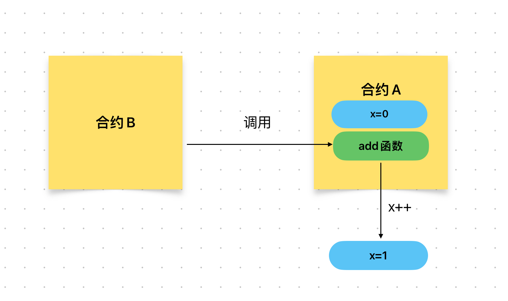

# Content/概念

### Concept

上一节中，我们学习了如何定义一个合约类型的变量。

在这一节中我们将更进一步，学习如何调用其他合约的函数，以获取返回值或者修改其他合约的变量。

- 比喻
    
    假设有两个合约：***ContractA***和***ContractB***。***ContractB***想要调用***ContractA***的***add***函数使***ContractA***的某个变量加一，这时涉及到函数的调用。
    
    与调用自己的函数不同的点在于：在调用其他合约的函数时，要在函数名前需要指定合约变量，这是为了准确的定位到你想要调用的合约中的函数。
    
    ```solidity
    contract ContractA {
      uint public x = 0;
    
      function add() public {
        x++;
      }
    }
    
    contract ContractB {
      ...
      // 调用ContractA的add函数
      contractA.add();
      ...
    }
    ```
    
    
    
- 真实用例
    
    同样在[***GovernorTimelockControl***](https://github.com/OpenZeppelin/openzeppelin-contracts/blob/9ef69c03d13230aeff24d91cb54c9d24c4de7c8b/contracts/governance/extensions/GovernorTimelockControl.sol#L25) 合约中，使用刚刚定义的***_timelock***合约变量来调用***[TimelockController](https://github.com/OpenZeppelin/openzeppelin-contracts/blob/9ef69c03d13230aeff24d91cb54c9d24c4de7c8b/contracts/governance/TimelockController.sol#L24)***合约的***getMinDelay***函数。
    
    ```solidity
    function _queueOperations(
        ....
    ) internal virtual override returns (uint48) {
        uint256 delay = _timelock.getMinDelay();
        ...
    }
    ```
    

### Documentation

我们使用`ContractName.functionName(parameters)`的形式来调用外部合约的函数。

```solidity
//在这里我们调用了HQToken这个合约中的transfer函数，并将msg.sender和amount作为参数传入。
HQToken.transfer(msg.sender, amount);
```

### FAQ

- 函数的调用有限制条件吗？
    
    调用函数本身的限制条件在于函数可见性。
    
    如果是用户和合约之间，只能调用public或external的函数。
    
    如果是合约内部的函数之间相互调用，则没有限制条件。
    
    被external修饰的函数可以直接用调用。
    
    ```cpp
    this.functionName()
    ```

# Example/示例代码

```solidity
// SPDX-License-Identifier: MIT
pragma solidity ^0.8.0;

// 合约B
contract B {
  uint public result;

  function foo(uint _input) public {
    result = _input * 2;
  }
}

// 合约A
contract A {
  B public b;

  constructor(address _bAddress) {
    b = B(_bAddress);
  }
  //调用B合约的foo函数
  function callBFunction(uint _input) public {
    b.foo(_input);
  }
}
```
