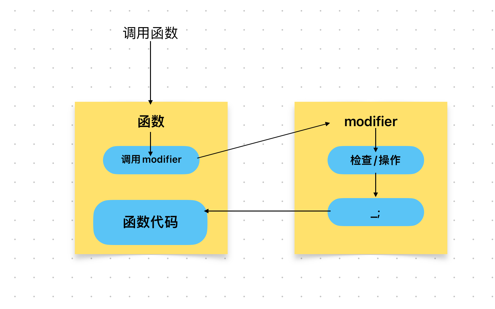

# Content/概念

### Concept

在前面两节的学习中，我们了解了函数修饰符（modifier）的基础语法，了解了它是如何定义的以及它的一些基础特性。那么接下来，我们将会学习 modifier 的**使用方法**和应用场景。

修饰符在智能合约中经常被用于实现一些安全和访问控制的功能。通过添加修饰符，你可以在执行函数之前添加一些预设条件，从而使得函数的使用更加安全和可控。

- 比喻
    
    在 Solidity 函数中使用修饰符（modifier）就像给一个受限制的房间加上安全锁。这把锁确保只有拥有正确钥匙（即满足修饰符条件）的人才能进入房间，并在房间内执行特定操作（即函数执行）。
    
- 真实用例
    
    在OpenZepplin给出的***[OwnableUpgradeable](https://github.com/OpenZeppelin/openzeppelin-contracts-upgradeable/blob/7d7ad99dee371e0ee042e2999aaf43941dea1513/contracts/access/OwnableUpgradeable.sol#L89C1-L94C6)***合约中一个***transferOwnership***函数。它使用了***onlyOwner***修饰符，确保只有当前的所有者（即合约的拥有者）能调用这个函数来转移所有权。这样设计主要是为了安全和权限管理，确保只有合约的合法所有者可以更改其所有权，并且不能设置为无效地址。
    
    ```solidity
    function transferOwnership(address newOwner) public virtual onlyOwner {
            if (newOwner == address(0)) {
                revert OwnableInvalidOwner(address(0));
            }
            _transferOwnership(newOwner);
        }
    ```
    

### Documentation

作为关键字出现在函数参数和`{}`之间，无参数型不需要括号。

```solidity
//在这里我们使用***lock***这个modifier修饰了***transfer***这个函数。
function transfer(address to, uint256 amount) public lock {

}

//作为关键字出现在函数参数和{}之间，有参数型把参数放在括号里即可。
function transfer2(address to, uint256 tokenId) public lock(tokenId) {

}
```

### FAQ

- 意思是只要函数头中有modifier，就会执行其中的代码吗？
    
    是的，一旦函数被modifier修饰，在调用该函数之前，都会进入此modifier中执行代码。
    
    

# Example/示例代码

```solidity
// SPDX-License-Identifier: MIT
pragma solidity ^0.8.0;

contract Example {
  uint256 public number;

  modifier add() {
    number++;
    _;
    number++;
  }
  //调用一次该函数number的值会增加2，且该函数的返回值总是比number的值小1
  //这是因为number++在函数执行前后都执行了一次
  function doSomething() public add returns (uint256) {
    return number;
  }
}
```