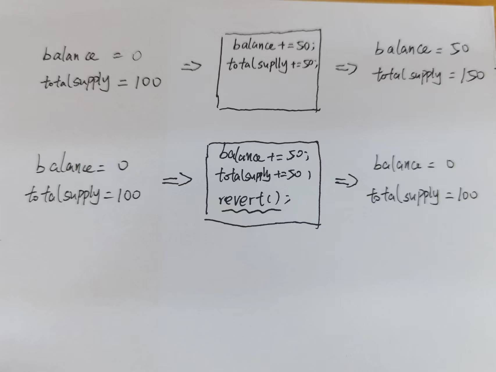

# Content/概念

### Concept

从本节开始，我们将讲解Solidity中的异常处理机制。在之前的学习中，我们已经了解了一种常用的异常处理语句`require`。在本节中，我们将介绍另一种异常处理语法——`revert`。

当在Solidity合约中发生异常情况时，`revert`语句的作用是立即停止当前函数的执行，并撤销所有对状态的更改。



- 比喻
    
    以日常生活中的购物退货为例：假设购买了一件上衣，但发现尺寸不合适或有瑕疵，我们会去退货。退货时，商家需要将已支付的款项还给你，而你则需要归还上衣。在这个过程中，退货操作就相当于`revert`，使得账户状态回到购物前的状态，保证了双方利益不受损失。
    
- 真实用例
    
    在ERC20合约中，***[_approve](https://github.com/OpenZeppelin/openzeppelin-contracts/blob/9ef69c03d13230aeff24d91cb54c9d24c4de7c8b/contracts/token/ERC20/ERC20.sol#L340C1-L351C6)***函数使用 `revert` 语句来处理多个异常，并且抛出了两个不同的异常类型。
    
    ```solidity
    function _approve(address owner, address spender, uint256 value, bool emitEvent) internal virtual {
            if (owner == address(0)) {
                revert ERC20InvalidApprover(address(0));
            }
            if (spender == address(0)) {
                revert ERC20InvalidSpender(address(0));
            }
            _allowances[owner][spender] = value;
            if (emitEvent) {
                emit Approval(owner, spender, value);
            }
        }
    ```
    

### Documentation

`revert()`函数在没有任何参数的情况下使用，用于终止函数的执行并回滚所有状态变化。它会自动返回一个默认的错误消息，指示函数执行失败。

也可以在 `revert` 关键字后附带一个字符串参数，以提供自定义的错误消息。这样可以在函数终止时提供更具体和详细的错误信息，方便开发者和用户理解发生的错误。

```solidity
revert();
revert("Custom error message");
```

### FAQ

- revert和require有何异同？
    
    **同**
    
    从底层的角度来看，两种方法是相同的。两者都会抛出一个异常。例如，下面`revert`语句和`require`语句是等价的。
    
    在gas消耗方面，两者一样都会向剩余的gas费返还给调用者。
    
    ```solidity
    if (num == 1) { 
    		revert(‘Something bad happened’);
    }
    
    require(num == 1, ‘Something bad happened’);
    ```
    
    **异**
    
    在solidity中，`require`通常用来对函数的参数进行条件判断，确保函数调用的参数符合预期。
    
    而当我们需要处理像`if-else`这样复杂的判断异常情况时，就需要使用到`revert`来更灵活的处理异常了。
    
    ```solidity
    if(num == 1) {
        revert("[error1] : num == 1");
    } else if(num == 10) {
    		revert("[error2] : num == 10");
    } else if(num == 100) {
    		revert("[error3] : num == 100");
    } else{
        //执行其他的逻辑
    }
    ```

# Example/示例代码

```solidity
pragma solidity 0.6.0;

contract Bank {
    mapping(address => uint256) balanceOf;

    function deposit(uint256 amount) public payable {
				//使用require对参数进行检查
        require(msg.value == amount, "Deposit amount must be equal to the sent value");
        uint256 oldBalance = balanceOf[msg.sender];
        balanceOf[msg.sender] += amount;
    }

    function withdraw(uint256 amount) public {
				//当需要使用if - else这种分支判断多个可能的错误情况时，可以使用revert。
        if(amount <= 0){
            revert("Invalid withdrawal amount");
        }else if(balanceOf[msg.sender] < amount){
            revert("Insufficient balance for withdrawal");
        }
        payable(msg.sender).transfer(amount);
        uint256 oldBalance = balanceOf[msg.sender];
        balanceOf[msg.sender] -= amount;
    }
}
```