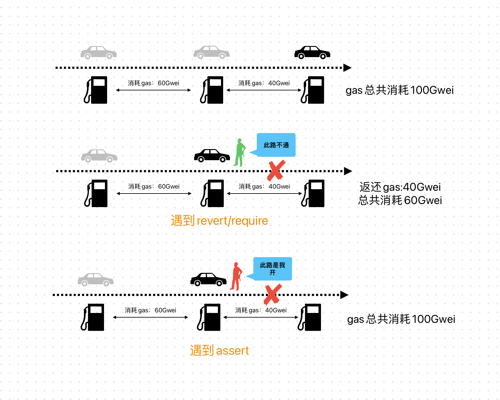

# Content/概念

### Concept

在前面，我们学习了`require`和`revert`两种错误处理机制，而我们还要将一个新的错误处理语法——`assert`。

`assert`语句应用于检查一些被认为永远不应该发生的情况（例如除数为0），如果发生这种情况，则说明你的合约中存在错误，你应该修复。

- 比喻
    
    assert的作用和revert没有区别，但在gas的消耗上有较大的差异：
    
    1. **assert**：使用assert时，它会消耗掉调用者所发送的剩余未使用的gas。你可以将其看作一个恶霸，它不仅阻止你的前进，还会夺走你身上携带的所有现金。
    2. **revert和require**：与assert不同，revert和require更像是施工队。它们只会阻止你前进，但不会抢走你的财物。当使用revert或require时，Solidity会将未使用的gas退还给调用者。
    
    
    
- 真实用例
    
    在UniswapV3中，***[E2E_swap](https://github.com/Uniswap/v3-core/blob/d8b1c635c275d2a9450bd6a78f3fa2484fef73eb/audits/tob/contracts/crytic/echidna/E2E_swap.sol#L104C1-L117C6)***合约使用了`assert`语句来断言流动性的变化为零。
    
    ```solidity
    function check_liquidityNet_invariant() internal {
        ...
        assert(liquidityNet == 0);
    }
    ```
    

### Documentation

在Solidity中，使用`assert`关键字来检查内部错误和不变式（invariant），以确保代码的正确性。

```solidity
//确认a 和 b在任何情况下都相等
assert(a == b);
```

### FAQ

- require，revert，和assert的使用场景分别是什么样的？
    - **require()用法：**
        1. 验证用户输入，例如：`require(input < 20);`
        2. 验证外部合约的调用，例如：`require(external.send(amount));`
        3. 在执行之前验证状态条件，例如：`require(balance[msg.sender] >= amount)`
    - **revert()用法：**
        1. 处理与`require()`类似但逻辑更复杂的情况
        2. 当存在复杂的嵌套if/else逻辑流时，可以使用`revert()`代替`require()`
        3. 请注意，复杂的逻辑可能是代码质量不佳的一个迹象，所以在开发中请尽量避免使用revert。
    - **assert()用法：**
        1. 检查溢出/下溢，例如：`c = a + b; assert(c > b);`
        2. 检查不变量，例如：`assert(this.balance >= totalSupply);`
        3. 在更改后验证状态
        4. 防止永远不可能发生的情况

# Example/示例代码

```solidity
pragma solidity 0.6.0;

contract Bank {
    mapping(address => uint256) balanceOf;

    function deposit(uint256 amount) public payable {
				//使用require对参数进行检查
        require(msg.value == amount, "Deposit amount must be equal to the sent value");
        uint256 oldBalance = balanceOf[msg.sender];
        balanceOf[msg.sender] += amount;

				//使用assert对代码执行正确性进行检查（在这里是防止溢出）
        assert(balanceOf[msg.sender] > oldBalance);
    }

    function withdraw(uint256 amount) public {
				//当需要使用if - else这种分支判断多个可能的错误情况时，可以使用revert。
        if(amount < 0) {
            revert("Invalid withdrawal amount");
        } else if(balanceOf[msg.sender] < amount) {
            revert("Insufficient balance for withdrawal");
        }
        payable(msg.sender).transfer(amount);
        uint256 oldBalance = balanceOf[msg.sender];
        balanceOf[msg.sender] -= amount;

				//使用assert对代码执行正确性进行检查（在这里是防止溢出）
        //使用assert时，它会消耗掉调用者所发送的剩余未使用的gas。
        assert(balanceOf[msg.sender] >= oldBalance);
    }
}
```