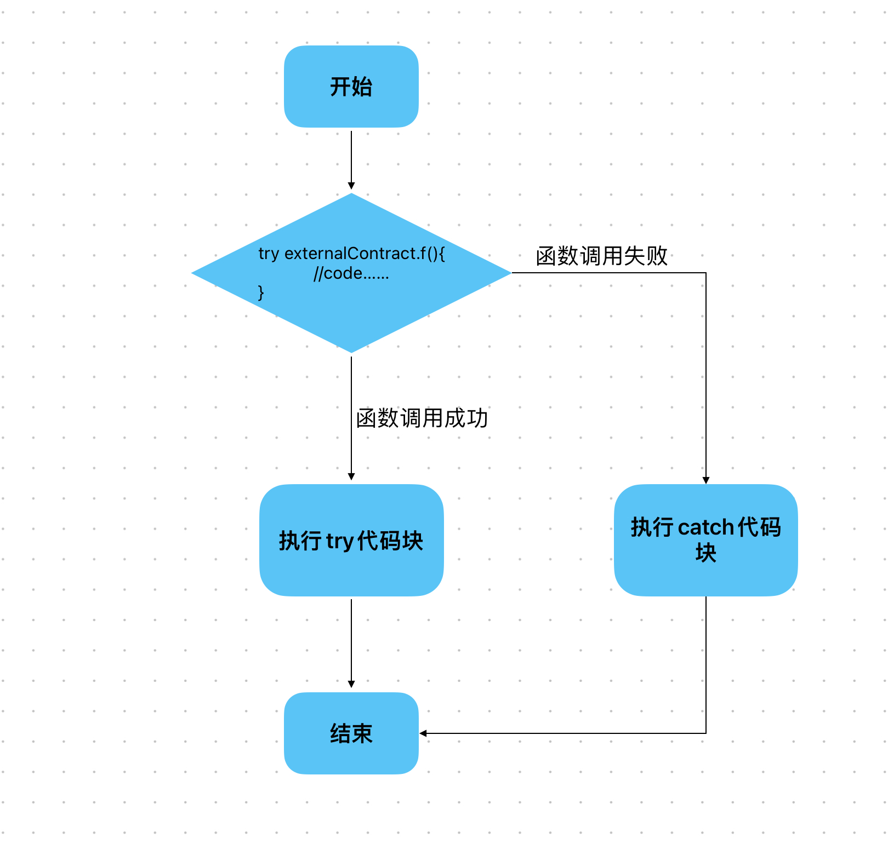

# Content/概念

### Concept

前面我们学习了`require`，`revert`和`assert`。这些都是终止函数执行的错误处理机制。

然而，有时我们希望能够在处理错误时执行其他逻辑，而不仅仅是终止函数执行。这就需要使用`try-catch`语句了。

- 比喻
    
    就像在跳绳比赛中，我们可能会失误，而我们又不想因此而终止这次跳绳，所以我们要捕捉失误这种异常，从而做出正确的处理——重新开始跳绳。
    
    失误就是try，而重新开始跳绳则是catch的过程。
    
- 真实用例
    
    在OpenZepplin的***[GovernorVotes](https://github.com/OpenZeppelin/openzeppelin-contracts/blob/9ef69c03d13230aeff24d91cb54c9d24c4de7c8b/contracts/governance/extensions/GovernorVotes.sol#L25C1-L31C6)***合约中有一个获取时间的函数***clock***，该函数将调用`token.clock()`来获取时间，但是由于可能的错误，该调用会被回滚。
    为了保证治理的正常执行，这里使用`try-catch`语句来捕获可能出现的异常，并在出现异常的时候调用`SafeCast.toUint48(block.number)`来将当前区块号作为时间返回。
    
    ```solidity
    function clock() public view virtual override returns (uint48) {
        try token.clock() returns (uint48 timepoint) {
            return timepoint;
        } catch {
            return SafeCast.toUint48(block.number);
        }
    }
    ```
    

### Documentation

在Solidity中，使用`try-catch`语句来处理可能存在的错误。并且可以使用`catch (error err)`语句来捕获特定的错误类型：

```solidity
try recipient.send(amount) {
    // 正常执行的处理逻辑
} catch Error(string memory err) {
    // 捕获特定错误类型为Error的处理逻辑
    // 可以根据错误信息err进行相应的处理
} catch (bytes memory) {
    // 捕获其他错误类型的处理逻辑
    // 处理除了已声明的特定类型之外的所有错误
}
```

### FAQ

- 为什么使用try - catch？
    
    通过try-catch，我们可以捕获和处理特定的错误，而不会中止整个函数的执行。这使得我们能够在处理错误时采取适当的措施，例如记录错误信息、回滚状态或执行其他逻辑来修复错误。
    
    在需要处理可能失败的函数调用时，我们可以使用 `try` 语句。将函数调用放在 `try` 中，如果调用成功，则执行 `try` 中的代码；如果调用失败，则执行 `catch` 中的代码。
    
    
    
- try语句可以单独存在吗？
    
    `try`语句可以单独存在，不需要写`catch` 语句。

# Example/示例代码

```solidity
pragma solidity ^0.8.0;

contract PaymentExample {
    event Success();
    event Failure();

    function sendEther(address contractB) public {
        try B(contractB).dosome() {
            emit Success();
            // 执行发送成功的逻辑
        } catch {
            emit Failure();
            // 执行发送失败的逻辑
        }
    }

}

contract B {

    function dosome() public {
        revert();
    }

}
```

# **Button/Try it out**