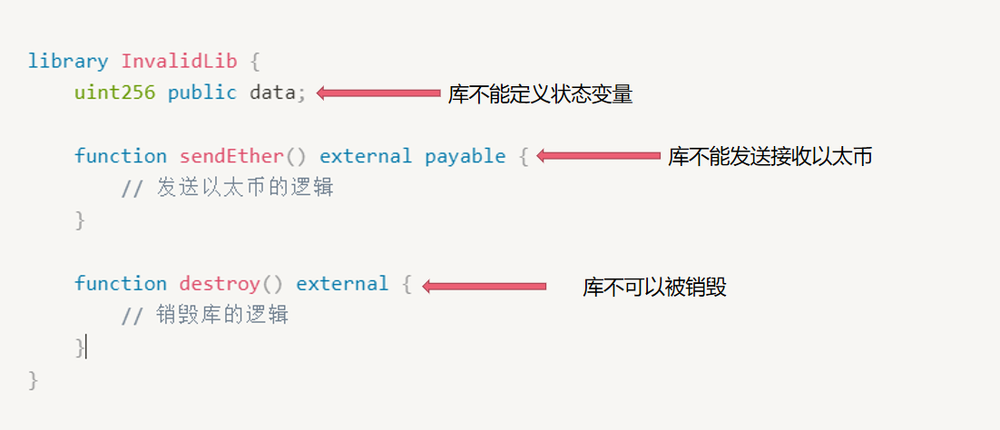

# Content/概念

### Concept

这节我们将开始库（`library`）的学习，这是一种特殊的合约。

库与合约类似，但主要用于**重用代码**。库包含其他合约可以调用的函数。

我们把可以反复利用的代码独立出来，成为一个库。

- 比喻
    
    例如，你可能经常需要进行数学计算，如加法、乘法和求平方根等。你可以创建一个数学库，其中包含这些数学计算的函数。如下代码：
    
    ```solidity
    library MathLibrary {
        function square(uint256 x) external pure returns (uint256) {
            return x * x;
        }
    		...
    }
    ```
    
- 真实用例
    
    在Uniswap V3中就实现了一个用于数据转换的库***[SafeCast](https://github.com/Uniswap/v3-core/blob/d8b1c635c275d2a9450bd6a78f3fa2484fef73eb/contracts/libraries/SafeCast.sol#L6C1-L28C2)***。
    
    ```solidity
    library SafeCast {
        /// @notice Cast a uint256 to a uint160, revert on overflow
        /// @param y The uint256 to be downcasted
        /// @return z The downcasted integer, now type uint160
        function toUint160(uint256 y) internal pure returns (uint160 z) {
            require((z = uint160(y)) == y);
        }
    
        /// @notice Cast a int256 to a int128, revert on overflow or underflow
        /// @param y The int256 to be downcasted
        /// @return z The downcasted integer, now type int128
        function toInt128(int256 y) internal pure returns (int128 z) {
            require((z = int128(y)) == y);
        }
    
        /// @notice Cast a uint256 to a int256, revert on overflow
        /// @param y The uint256 to be casted
        /// @return z The casted integer, now type int256
        function toInt256(uint256 y) internal pure returns (int256 z) {
            require(y < 2**255);
            z = int256(y);
        }
    }
    ```
    

### Documentation

我们可以使用`library`关键字来定义库。库的定义类似于合约的定义，但没有状态变量。

```solidity
//定义一个名为MathLibrary的库。
library MathLibrary {}
```

### FAQ

- libray在使用上有什么限制
    
    Solidity 对库的使用有一定的限制。以下是 Solidity 库的主要特征。
    
    1. 库不能定义状态变量；
    2. 库不能发送接收以太币；
    3. 库不可以被销毁，因为它是无状态的。
    4. 库不能继承和被继承；
    
    
    
    <aside>
    💡 *继承*这一概念我们会在后续章节学习
    
    </aside>

# Example/示例代码

```solidity
pragma solidity ^0.8.0;

//定义MathLibrary 库
library MathLibrary {
		//库中可以定义函数
    function square(uint256 x) external pure returns (uint256) {
        return x * x;
    }
}
```