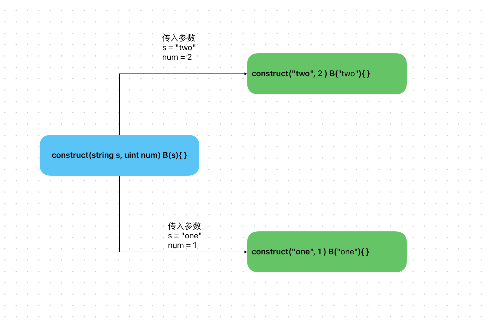

# Content/概念

### Concept

上一节中我们学习了如何继承合约。本节我们将学习如何在继承合约时正确初始化被继承合约的构造函数。

设想一个情景，合约***A***继承了合约***B***，这意味着合约***B***的代码被复制到了合约***A***中。这样一来，合约A中可能会存在两个构造函数的情况。

为了解决这个问题，Solidity 引入了一个机制——在继承时，继承合约需要在自己的构造函数中初始化被继承合约的构造函数。

- 比喻
    
    就像现实中我们要先有父亲，有了父亲才能创造儿子。
    
- 真实用例
    
    在OpenZepplin官方使用文档中给出以下代码，其中`ERC20("MyToken", "MTK")` 则是继承了[ERC20](https://github.com/OpenZeppelin/openzeppelin-contracts/blob/9ef69c03d13230aeff24d91cb54c9d24c4de7c8b/contracts/token/ERC20/ERC20.sol#L59C1-L62C6)中的构造函数，因此在这里需要对其进行传参初始化。
    
    ```solidity
    contract MyToken is ERC20, ERC20Burnable, Ownable {
        constructor() ERC20("MyToken", "MTK") {}
        ...
    }
    ```
    

### Documentation

我们只需要在构造函数参数字段结束后使用被继承合约的`ContractName(ParameterList)` 就可以正确初始化被继承合约的构造函数。

```solidity
//这里我们继承了ERC20并在构造函数中对ERC20中的构造函数进行了初始化。
constructor(string name, string symbol) ERC20(name, symbol) { }
```

### FAQ

- 能用图像的方式解释一下吗？
    
    如果被继承的合约中有一个有参数的构造函数，那么必须在继承合约的构造函数中初始化其构造函数。继承合约的构造函数中可以**传递参数**给被继承合约的构造函数。
    
    
# Example/示例代码

```solidity
pragma solidity ^0.8.0;

// 合约B
contract B {
    uint public bValue;

    constructor(uint _value) {
        bValue = _value;
    }
}

// 合约A 继承合约B
contract A is B {
    uint public aValue;
		// _valueA用于初始化aValue，
		// _valueB用于调用合约B的构造函数初始化bValue
    constructor(uint _valueA, uint _valueB) B(_valueB) {
        aValue = _valueA;
    }
}
```