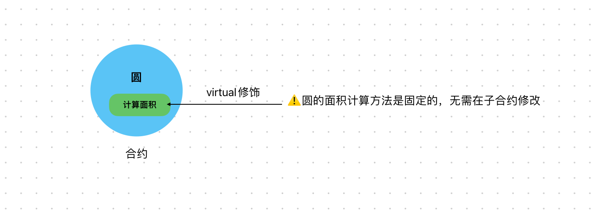

# Content/概念

### Concept

在本节中，我们将继续学习继承中的另一个知识——`virtual`关键字。

在父合约中，我们可以使用`virtual`关键字来标记函数为可重写的，然后在子合约中使用`override`关键字对其进行*覆盖*。

<aside>
💡 如果一个函数没有被`virtual`标记，则不能被重写。

</aside>

- 比喻
    
    还是以上一节的烹饪为例，我们需要将烹饪方法用`virtual`来标记，这样才可以对其改进。
    
    ```solidity
    function cooking(uint time) public virtual {
            // 祖传配方
    }
    ```
    
- 真实用例
    
    接着上一节的例子来讲，在父合约[ERC20](https://github.com/OpenZeppelin/openzeppelin-contracts/blob/fd81a96f01cc42ef1c9a5399364968d0e07e9e90/contracts/token/ERC20/ERC20.sol#L348)中则需要将***_beforeTokenTransfer***定义为`virtual`
    
    ```solidity
    function _beforeTokenTransfer(address from, address to, uint256 amount) internal virtual {}
    ```
    

### Documentation

在函数的定义中使用`virtual`关键字，定义该函数可以被子合约覆盖。

```solidity
function getArea() public virtual returns (uint) { }
```

例如这里我们定义了一个`virtual`修饰的***getArea***函数，这样就允许子合约对***getArea***进行覆盖，实现其特有的逻辑。

### FAQ

- 什么样的函数需要使用virtual关键字？
    
    需要注意的是，并非所有函数都需要使用`virtual`关键字。只有那些有可能需要在子合约中进行修改或定制的函数才需要被其标记。
    
    对于那些需要保持一致性的函数，可以不使用`virtual`关键字，从而确保其在继承的合约中的实现保持一致。
    
    > 因为他们不可以被重写，因此父合约所写的函数将原封不动的存在于子合约中。
    > 

# Example/示例代码

```solidity
pragma solidity ^0.8.0;

//定义了一个基础的Shape合约
contract Shape {
    uint public sides;

    constructor() {
        sides = 0;
    }
		//定义为virtual，可以被继承的计算面积的函数
		//子合约可以根据需要
    function getArea() public virtual returns (uint) {
        return 0;
    }
}
//正方形
contract Square is Shape {
    uint private sideLength;

    constructor(uint _sideLength) {
        sideLength = _sideLength;
        sides = 4;
    }
		//正方形的面积计算公式是边*边
    function getArea() public virtual override returns (uint) {
        return sideLength * sideLength;
    }
}
//三角形
contract Triangle is Shape {
    uint private base;
    uint private height;

    constructor(uint _base, uint _height) {
        base = _base;
        height = _height;
        sides = 3;
    }
		//三角形的计算公式是底*高/2
    function getArea() public virtual override returns (uint) {
        return (base * height) / 2;
    }
}
```