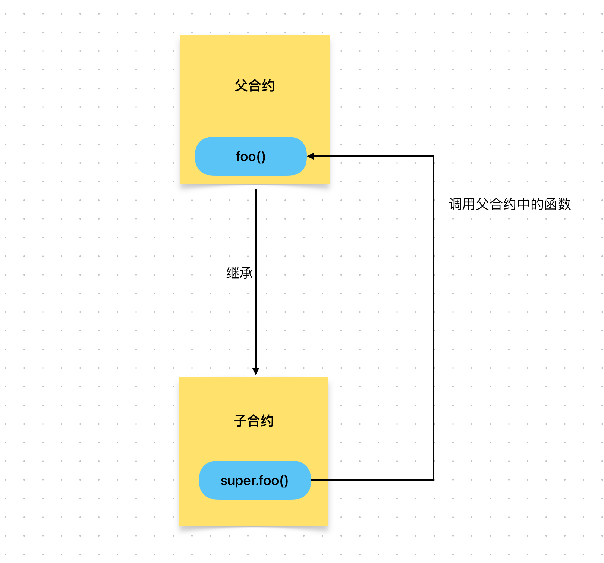

# Content/概念

### Concept

在本章中，我们将继续学习继承中`super`的用法，这是用于在子合约中用于调用父合约的函数和变量。



- 比喻
    
    前面讲到我们通过`override`覆盖了祖传烹饪方式，使用了新的烹饪方法，每个人的口味不一样，有的的喜欢祖传的烹饪方式。一天，你的妈妈希望你按传统的方式做菜。
    
    你可以使用`super`关键字来调用父合约（母亲菜谱）中的祖传烹饪方式。
    
    ```solidity
    super.cooking(time);
    ```
    
- 真实用例
    
    还是同样的例子，该函数中调用了`super._beforeTokenTransfer(from, to, amount);`这就会调用到[ERC20](https://github.com/OpenZeppelin/openzeppelin-contracts/blob/fd81a96f01cc42ef1c9a5399364968d0e07e9e90/contracts/token/ERC20/ERC20.sol#L348)中的***_beforeTokenTransfer***
    
    ```solidity
    function _beforeTokenTransfer(address from, address to, uint256 amount)
        internal
        whenNotPaused
        override
    {
        super._beforeTokenTransfer(from, to, amount);
    }
    ```
    

### Documentation

在函数内使用`super.functionName`即可调用父合约中的函数。

```solidity
//这里我们调用了父合约中的init函数。
super.init();
```

### FAQ

- 为什么需要调用父合约的函数和变量？
    
    通过使用`super`关键字，我们可以在子合约中调用父合约的函数，确保原有逻辑得到执行，从而保持代码的一致性和正确性。
    
    <aside>
    💡 通过调用父合约的函数，子合约可以重用父合约中的代码，避免重复编写相同的功能，提高代码的可维护性和可复用性。
    
    </aside>

# Example/示例代码

```solidity
pragma solidity ^0.8.0;

contract Parent {
    uint public value_Parent;

    function setValue(uint _newValue) public virtual {
        value_Parent = _newValue;
    }
}

contract Child is Parent {
    uint public value_Child;
		//调用完该函数后，value_Child应该被赋值为1，而value_Parent应该被赋值为2。
    function setValue(uint _newValue) public override {
				value_Child = _newValue;
        // 调用父合约的函数
        super.setValue(_newValue * 2);
    }
}
```