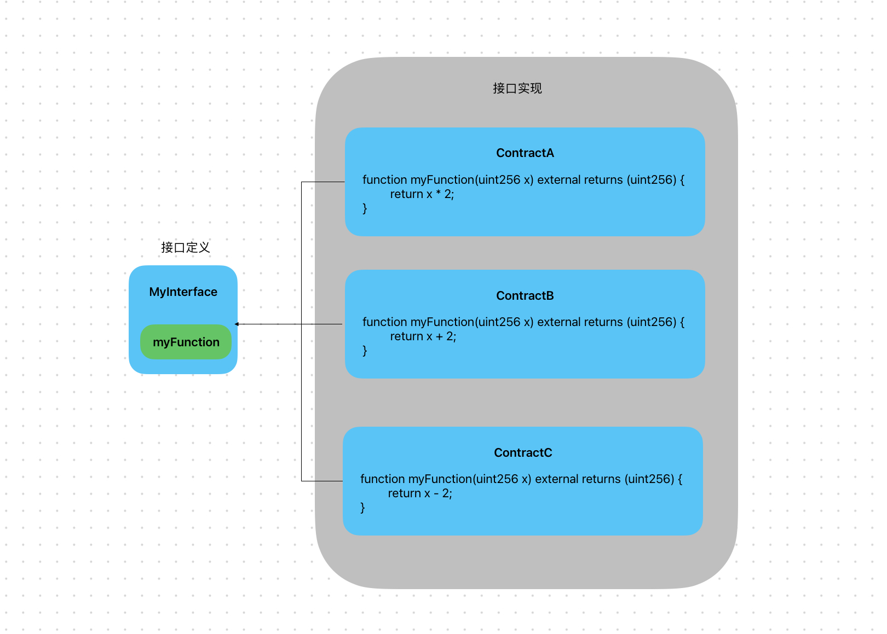

# Content/概念

### Concept

从这一节开始，我们将进入接口（`interface`）的学习。

可以将接口比喻为一个*合约*的一种规范，它指定了合约应该提供哪些功能和行为，但并不涉及具体实现的细节。接口定义了一组函数头，包括函数的名称、参数类型和返回类型，但没有函数体。

- 比喻
    
    接口就像是家庭中的电源插座。无论是什么品牌或型号的电器，只要符合电源插座的标准，就可以插入插座并获得电力供应。电源插座定义了电器应该遵循的接口规范，从而实现了不同电器与插座的互操作性。同样地，接口在Solidity中起到类似的作用，通过定义标准化的**函数签名**和**行为**，确保合约之间的兼容性和互操作性。
    
    
    
- 真实用例
    
    在OpenZepplin的ERC20的接口[IERC20](https://github.com/OpenZeppelin/openzeppelin-contracts/blob/9ef69c03d13230aeff24d91cb54c9d24c4de7c8b/contracts/token/ERC20/IERC20.sol#L9C1-L79C2)实现如下：
    
    ```solidity
    interface IERC20 {
        ...
        function transferFrom(address from, address to, uint256 amount) external returns (bool);
    }
    ```
    

### Documentation

我们使用`interface`关键字定义一个接口。

```solidity
interface MyInterface {
    function myFunction(uint256 x) external returns (uint256);
}
```

在这里我们定义了一个名为***MyInterface***的接口，其中有一个接口函数***myFunction***。

### FAQ

- 接口有哪些特性？
    - 接口不能实现任何函数；
    - 接口无法*继承*其它合约，但可以*继承*其它接口；
    - 接口中的所有函数声明必须是`external`的；
    - 接口不能定义*构造函数*；
    - 接口不能定义*状态变量*；

# Example/示例代码

```solidity
pragma solidity ^0.8.0;

// 定义接口
interface MyInterface {
		//接口中的函数必须定义为external，因为设计接口的目的是提供给外部调用。
		//函数接口中，参数名可以省略，myFunction(uint256)的写法也是可以的。
    function myFunction(uint256 x) external returns (uint256);
}

// 实现接口的合约
contract MyContract {
    function myFunction(uint256 x) external returns (uint256) {
        // 实现函数的具体逻辑
        return x * 2;
    }
}

// 使用接口调用函数的合约
contract CallerContract {
    MyInterface public myContract;

		//传入MyContract的地址
    constructor(address contractAddress) {
        myContract = MyInterface(contractAddress);
    }
		//通过接口调用MyContract中的myFunction函数（接口调用我们会在下一节中详细讲解）
    function callInterface(uint256 value) public returns (uint256) {
        uint256 result = myContract.myFunction(value);
        return result;
    }
}
```