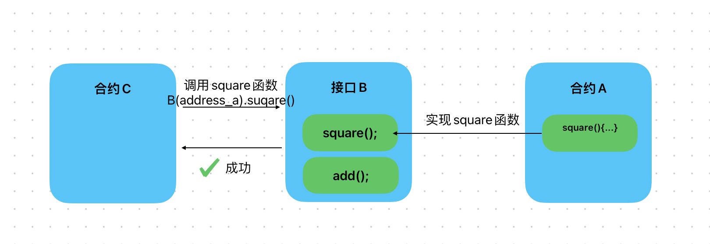

# Content/概念

### Concept

刚刚我们学习了接口的定义，现在我们会学习如何使用接口来与外部合约进行交互。

一旦我们定义好了接口，就可以使用`interfaceName(address).functionName()`的方式与其他合约进行交互。

```solidity
MyInterface(contractAddress).myFunction();
```

- 比喻
    
    例如我们可以把接口视为餐厅的菜单。 菜单告诉你可以点的菜肴的名称，甚至可能描述它里面有哪些食材，但它不会告诉你这些菜肴是如何准备的——这是厨房工作人员的工作（即实现接口的合约）。 当客户（另一个合约）想要点东西时，他们会查看菜单（接口），但实际上是厨房工作人员（实现接口的合约）准备和提供菜肴（执行功能）。
    
- 真实用例
    
    在***[ERC20Wrapper](https://github.com/OpenZeppelin/openzeppelin-contracts/blob/9ef69c03d13230aeff24d91cb54c9d24c4de7c8b/contracts/token/ERC20/extensions/ERC20Wrapper.sol#L16C1-L86C2)***的实现中，***_underlying***被定义为接口变量，随后可以使用`interface.functionName()`的方式调用***balanceOf***函数。
    
    ```solidity
    abstract contract ERC20Wrapper is ERC20 {
        IERC20 private immutable _underlying;
    
        function _recover(address account) internal virtual returns (uint256) {
            uint256 value = _underlying.balanceOf(address(this)) - totalSupply();
            _mint(account, value);
            return value;
        }
    }
    ```
    

### Documentation

要使用接口来交互，我们需要三个信息

1. 接口的名称/定义
2. 实现接口的合约地址
3. 需要调用的函数

我们可以使用`interfaceName(address).functionName()`的方式调用其他合约的函数。

```solidity
//先定义一个接口变量otherContract
OtherContractInterface  otherContract = OtherContractInterface(otherContractAddress);
//随后使用interface.getValue()调用otherContract的getValue函数
otherContract.getValue();
```

### FAQ

- 为什么需要接口来与其他合约交互？
    
    接口的使用场景一般在与：我们知道要调用的合约地址，并且知道想调用的函数是什么，但不知道合约的具体实现时。
    
    
    
    这就好像我们在餐厅吃饭，我们知道餐厅的具体位置，并且知道想点的菜品是什么，但我们不知道菜品具体的烹饪方式。这时我们就需要使用这个餐厅的菜单这个接口来和这个餐厅进行交互。
    
    > 如果你错误的使用了其他餐厅的菜单与该餐厅进行交互，该餐厅可能无法理解你的需求，从而导致你无法点单。

# Example/示例代码

```solidity
pragma solidity ^0.8.0;

// 定义接口
interface OtherContractInterface {
    function getValue() external view returns (uint256);
    function setValue(uint256 newValue) external;
}

// 合约A
contract ContractA {
    uint256 public value;

    function setValue(uint256 newValue) public {
        value = newValue;
    }
		//参数为B合约地址,随后使用接口调用B合约
    function callGetValue(address contractAAddress) public view returns (uint256) {
        ContractB contractB = ContractB(contractAAddress);
        return contractB.getOtherContractValue();
    }
}

// 合约B
contract ContractB {
		//接口类型的变量，类似与合约变量
    OtherContractInterface public otherContract;
		
		//在构造函数中为其赋值
    constructor(address otherContractAddress) {
        otherContract = OtherContractInterface(otherContractAddress);
    }
		//使用接口调用setValue函数
    function callSetValue(uint256 newValue) public {
        otherContract.setValue(newValue);
    }

    function getOtherContractValue() public view returns (uint256) {
        return 5;
    }
}
```