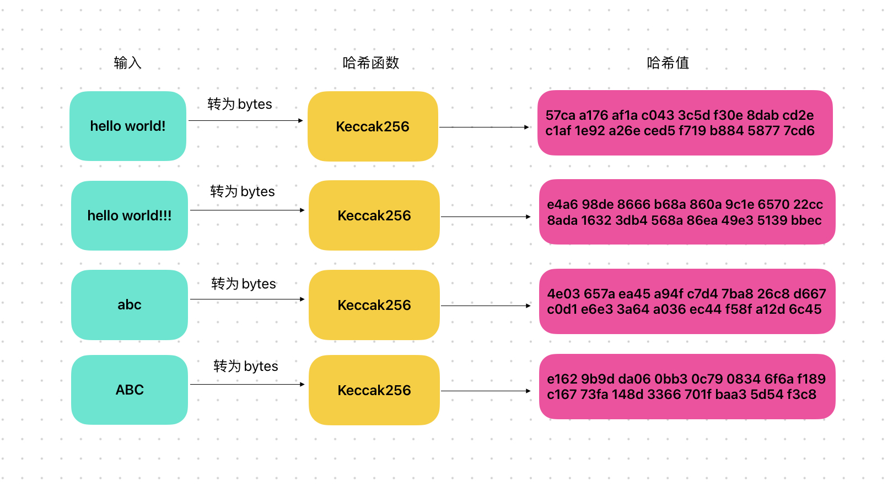

# Content/概念

### Concept

在本节中，我们将学习solidity当中的哈希计算。

哈希计算是一种将任意长度的数据转换为固定长度哈希值的过程。而哈希的特点是——不同的字符串哈希出来的结果几乎不可能相同。

```solidity
"hello world!!!" -> ds1b
"hello world!" -> tgf4
```

<aside>
💡 这在生成数据唯一标识、加密签名等领域有重大意义。

</aside>

- 比喻
    
    我们可以将哈希函数比喻为一个魔术机器。你将任意物体放入这个机器中，它会将物体转化为一个独特的、不可逆的标识。这个标识可以用来识别物体，但无法通过标识来还原出原始物体。
    
- 真实用例
    
    在[EIP712](https://github.com/OpenZeppelin/openzeppelin-contracts/blob/9ef69c03d13230aeff24d91cb54c9d24c4de7c8b/contracts/utils/cryptography/EIP712.sol#L88C1-L91C1)中，使用了***keccak256***来计算某个域特有的哈希
    
    ```solidity
    function _buildDomainSeparator() private view returns (bytes32) {
        return keccak256(abi.encode(_TYPE_HASH, _hashedName, _hashedVersion, block.chainid, address(this)));
    }
    ```
    

### Documentation

***keccak256***是一个全局函数，可以在函数中直接使用该函数进行哈希计算。

- 输入：只接受`bytes`类型的输入。
- 输出：`bytes32`长度的字节。

```solidity
//这里我们将字符串”HackQuest"转换成字节数组后，进行哈希的结果赋值给了res变量。
bytes32 res = keccak256(bytes("HackQuest"));
```

### FAQ

- 有哪些哈希算法？
    
    Keccak256 和 SHA3 是用于哈希计算的两个算法。
    
    然而由于在以太坊的开发过程中，SHA3 还处于标准化阶段，以太坊开发团队选择了使用Keccak256来代替它。所以EVM和solidity中的Keccak256和SHA3都是使用Keccak256算法计算的哈希。为了避免概念混淆，在合约代码中直接使用 Keccak256 是最清晰和推荐的做法。
    
# Example/示例代码

```solidity
pragma solidity ^0.8.0;

contract KeccakExample {
		//接收一个字符串参数 _message，并返回一个32字节的哈希值（bytes32类型）。
		//在函数内部，我们使用keccak256函数来对输入字符串进行哈希运算，并将结果返回。
    function hash(string memory _message) public pure returns (bytes32) {
        return keccak256(bytes(_message));
    }
}
```