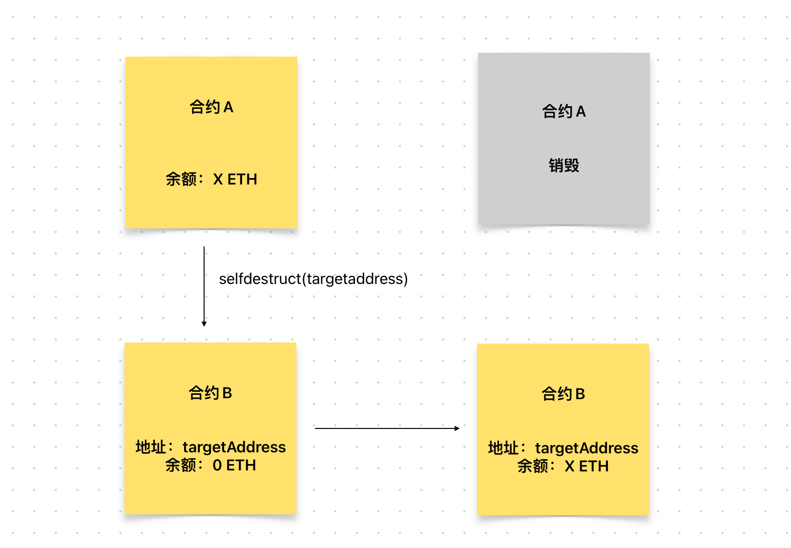

# Content/概念

### Concept

在这一节中，我们来讲一个特殊情况：selfdestruct函数。

顾名思义，selfdestruct函数即自毁。这是solidity当中一个内置的特殊函数，调用该函数后，将触发合约的自毁，自毁将该合约从区块链中删除，在删除前，他还会将合约中存储的剩余ETH转移给指定的账户。

- 比喻
    
    类似于现实中的销户并将所有的资金转移到另一个账户。例如，在下面的例子中，合约A调用了selfdestruct函数，并传入了合约B的地址。这将导致合约A的所有余额被转移到合约B的地址，并且合约A的代码将从区块链上被删除。
    
    
    
- 真实用例
    
    selfdestruct是一个极为特殊的函数，因为它可以将合约删除。我们查遍了OpenZeppelin的代码库，没有任何一个合约使用了这句语法。
    
    selfdestruct极易带来安全隐患，同样我们不建议任何合约为selfdestruct提供接口，如果一定要使用，请慎重考虑安全问题。
    
    开源项目中***saucepoint***提供了一个[参考](https://github.com/saucepoint/sylphrena/blob/fa511e4d8163902c5fd60af58f72ead54c797863/src/Spren.sol#L12) 
    
    ```solidity
    // SPDX-License-Identifier: UNLICENSED
    pragma solidity ^0.8.13;
    
    contract Spren {
        address immutable stormFather;
    
        constructor(address _stormFather) {
            stormFather = _stormFather;
        }
    
        function unbond(address oathBreaker) external {
            require(msg.sender == stormFather, "only stormfather can unbond");
            selfdestruct(payable(oathBreaker));
        }
    }
    ```
    

### Documentation

在函数中可以直接调用该内置函数。

```solidity
//我们调用selfdestruct函数，指定将合约中剩余的ETH发送给*targetAddress*地址。
selfdestruct(targetAddress);
```

### FAQ

- 什么时候使用 selfdestruct？
    
    这就相当于你有一个数字钱包，里面存有一定数量的加密货币（比如以太币）。你决定销毁这个数字钱包， 并且将其中的余额转移到你的另一个钱包地址上。你可以使用类似于selfdestruct ****函数的操作来实现这个过程。
    

# Example/示例代码

```solidity
contract DigitalWallet {
    address payable public targetAddress;

		//可以在部署时指定一个自毁时转移资产的地址
    constructor(address payable _targetAddress) payable {
        targetAddress = _targetAddress;
    }
		
		//自毁，会将合约剩余的所有ETH转给targetAddress地址。
    function destroy() external {
        selfdestruct(targetAddress);
    }
}
```