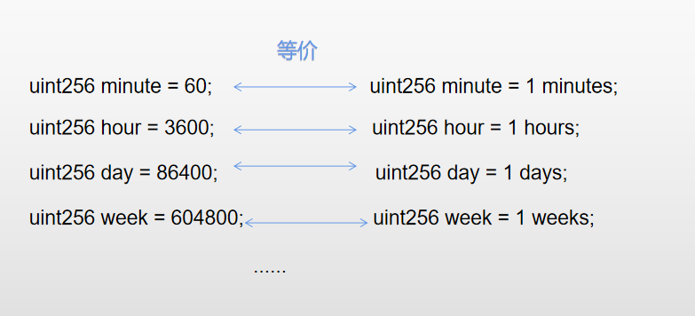

# Content/概念

### Concept

在这一节当中，我们将学习 Solidity 当中关于日期和时间的单位。

在 Solidity 中，时间戳是以秒为单位表示时间的，当我们想要表示一分钟时，可能还可以很快地意识到它是60秒，但是如果是一周、一个月或一年呢？

在编写代码时花费时间计算这些时间是不划算的。此外，直接使用秒数表示长时间间隔会降低代码的可读性。因此，Solidity 提供了一些全局变量，如 days，weeks，供开发者使用，以便更方便地表示一段时间。



- 比喻
    
    假设你要设置一个7天后结束的活动，可以这样表示：
    
    ```solidity
    uint256 endTime = block.timestamp + 7 days;
    ```
    
- 真实用例
    
    在OpenZepplin的[AccessControlDefaultAdminRules](https://github.com/OpenZeppelin/openzeppelin-contracts/blob/9ef69c03d13230aeff24d91cb54c9d24c4de7c8b/contracts/access/extensions/AccessControlDefaultAdminRules.sol#L200)合约中，使用 *5* days作为delay的默认时间，既增加了可读性又避免了计算失误。
    
    ```solidity
    function defaultAdminDelayIncreaseWait() public view virtual returns (uint48) {
        return 5 days;
    }
    ```
    

### Documentation

使用minutes， hours， days， weeks这样的时间单位时，需要在前面指定单位的数量。

```solidity
uint256 minute = 1 minutes;
uint256 minute = minutes; // 错误用法
uint256 hour= 1 hours;
uint256 day= 1 days;
uint256 week= 1 weeks;
```

### FAQ

- 那一个月可能有30天或31天，一年可能存在闰年，solidity是怎么处理year这种变量的呢？
    
    正是因为出现这种分歧，所以这两种时间表示方式在solidity当中被禁用了。要表示year，一般用365*day来表示。
    

# Example/示例代码

```solidity
pragma solidity ^0.8.0;

contract TokenLock {
    uint256 public releaseTime;
    uint256 public lockDuration;

    constructor() {
        lockDuration = 30 days; // 锁定期为30天
        releaseTime = block.timestamp + lockDuration; // 根据当前时间计算释放时间
    }

    function isLocked() public view returns (bool) {
        return block.timestamp < releaseTime; // 检查当前时间是否在锁定期内
    }
}
```