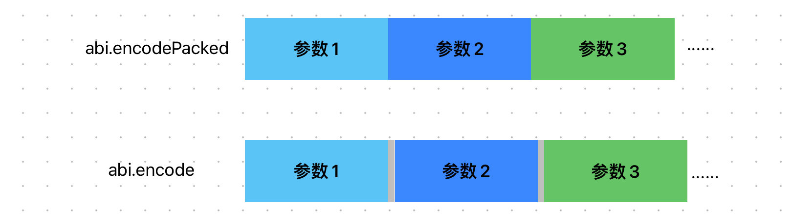

# Content/概念

### Concept

在本节中，我们将学习 abi.encodePacked，这是一个与 abi.encode 类似但有所不同的全局函数。它也用于将参数编码为符合 **ABI** 标准的*字节数组*，但不会为每个参数添加其类型的长度信息，也不会在参数之间添加分隔符，结果是一个紧密打包的字节数组。

- 比喻
    
    将 abi.encodePacked 想象成一个紧凑的行李箱，其中所有物品都被紧密地放置，没有任何空隙。而 abi.encode 则是一个更大的行李箱，其中每个物品都有自己的专用空间。
    
- 真实用例
    
    在 OpenZepplin 的 ***[MessageHashUtils](https://github.com/OpenZeppelin/openzeppelin-contracts/blob/9ef69c03d13230aeff24d91cb54c9d24c4de7c8b/contracts/utils/cryptography/MessageHashUtils.sol#L62)*** 合约中使用 abi.encodePacked 将参数编码后进行哈希。
    
    ```solidity
    function toDataWithIntendedValidatorHash(
        address validator,
        bytes memory data
    ) internal pure returns (bytes32 digest) {
        return keccak256(abi.encodePacked(hex"19_00", validator, data));
    }
    ```
    

### Documentation

可以直接在函数中调用`abi.encodePacked()`函数对数据进行编码。

```solidity
bytes memory encodedData = abi.encodePacked(param1, param2);
```

### FAQ

- 和abi.encode有什么区别？
    
    主要区别在于数据的压缩。
    
    - abi.encodePacked ****将参数紧密打包，就像将物品紧密地放在一起，没有任何额外的填充物或间隔。这种打包方式可以节省空间，但在解包时需要小心处理，因为物品之间没有明确的分隔符。
    - 相比之下，abi.encode ****使用标准的分隔符和填充物进行组织。就像将物品放入不同的袋子，并每个袋子都有标签和规范，以确保物品的结构和类型完整性。尽管可能需要更多的空间，但在解包时更容易处理和识别每个物品。
    
    
    
    <aside>
    💡 由于紧密打包的特点，abi.encodePacked 不能编码结构体和嵌套数组。
    
    </aside>
    
- 使用场景？
    
    abi.encodePacked 一般用在*hash*上。因为 *abi.encodePacked* 会比 *abi.encode* 编码出来的数据更短，所消耗的*gas*成本更低。
    
    <aside>
    💡 如果需要编码的数据中有两个动态数组，abi.encodePacked 可能会将两组数据编码成同一个字符串，这种时候应该使用 *abi.encode* 而不是*abi.encodePacked*。
    
    </aside>
    

# Example/示例代码

```solidity
pragma solidity ^0.8.0;

contract AbiEncodeExample {
		
    function encodeParameters(uint256 param1, string memory param2) public pure returns (bytes memory) {
        //对函数的两个参数进行编码。
				bytes memory encodedData = abi.encodePacked(param1, param2);
				//将编码的结果作为函数返回值返回。
        return encodedData;
    }
}
```