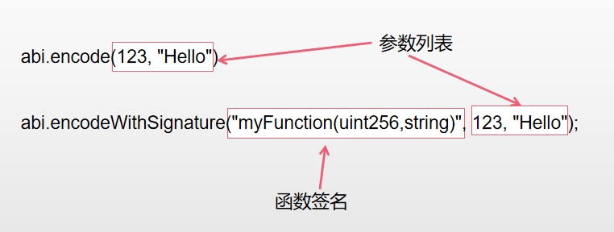

# Content/概念

### Concept

接下来我们将学习两种新的数据编码方式 abi.encodeWithSignature 和abi.encodeWithSelector。

首先我们会讲 abi.encodeWithSignature。

有的时候，我们知道函数调用可能会失败，但是我们不希望调用失败后交易直接回滚。这时候，我们就需要 abi.encodeWithSignature 去和底层**EVM**交互。具体交互方式，会在后续的 *low level call* 中讲解。但是encodeWithSignature提供了一种编码方式可以快捷的将调用函数需要的信息打包。

- 比喻
    
    使用 abi.encodeWithSignature 类似于准备一块带有特定图案的独特拼图碎片，你可以将其发送给朋友，他们可以轻松将其与他们的拼图连接起来，确保拼图块完美匹配并传达出清晰的信息。
    
- 真实用例
    
    假设我们有一个合约，该合约允许用户存储他们的消息。但是，我们不希望任何人都可以更改这些消息，所以我们要求用户签署他们的消息。为了验证这个签名，我们需要知道是哪个函数被调用以及传递了哪些参数。这就是abi.encodeWithSignature 派上用场的地方。
    
    考虑以下合约：
    
    ```solidity
    
    pragma solidity ^0.8.0;
    
    contract MessageStore {
        mapping(address => string) public messages;
    
        function storeMessage(string memory message) public {
            // 生成函数签名和参数的编码
            bytes memory encodedData = abi.encodeWithSignature("storeMessage(string)", message);
            
            // 在这里，我们可以使用encodedData来验证用户的签名（这部分代码被省略）
            // 如果签名验证成功，我们存储消息
            messages[msg.sender] = message;
        }
    }
    ```
    
    在这个真实用例中，我们使用 abi.encodeWithSignature 函数来编码***storeMessage*** 函数和用户提供的消息。然后，我们可以使用这个编码数据来验证用户的签名，确保只有签名正确的用户才能存储他们的消息。
    

### Documentation

可以直接在函数中调用`abi.encodeWithSignature`函数对数据进行编码。需要两种参数

1. *函数签名*
2. 函数具体参数

```solidity
abi.encodeWithSignature("myFunction(uint256,string)", 123, "Hello");
```

在上述代码中，我们使用了 abi.encodeWithSignature **函数来编码*函数签名*和*参数*。

### FAQ

- abi.encodeWithSignature 函数和abi.encode 函数以及 abi.encodePacked 函数有什么区别？
    - abi.encodeWithSignature 编码函数的签名和参数。类似于在菜谱上写下菜名（函数签名）和制作材料（参数），这样厨师就知道该做哪道菜以及需要哪些材料。
    - abi.encode 和 abi.encodePacked 编码函数的参数，但不包括函数的签名。类似于菜谱上写下了制作材料（*参数*），没有写菜名（*函数签名*）。这种情况下，厨师知道需要使用哪些材料，但不知道应该制作哪道菜。
        
        
        
        abi.encode 和 abi.encodePacked 更多的用途是在数据的存储和哈希上，而abi.encodeWithSignature 则是用于低级调用。
        

# Example/示例代码

```solidity
pragma solidity ^0.8.0;

contract SignatureExample {
    function dosome(uint256 number, string memory message) public pure {
        // 在这里执行一些操作
    }

    function getEncodedSignature() public pure returns (bytes memory) {
        // 使用 abi.encodeWithSignature() 编码dosome函数签名和参数
        bytes memory encodedData = abi.encodeWithSignature("dosome(uint256,string)", 123, "Hello");

        // 返回编码结果作为函数的返回值
        return encodedData;
    }
}
```