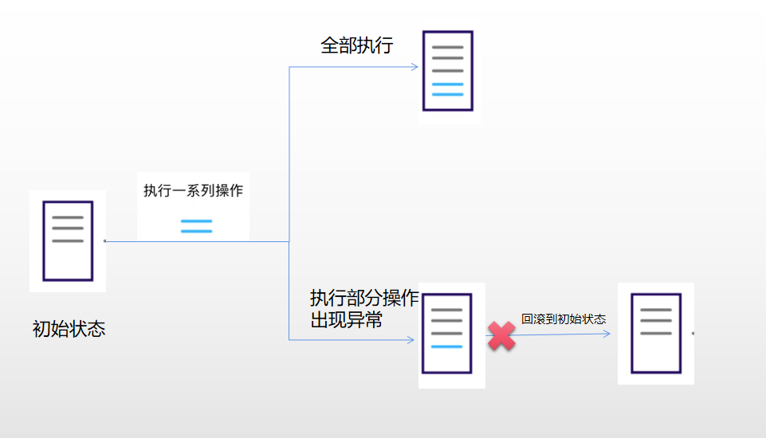

# Content/概念

### Concept

从本节开始，我们将开始学习 Solidity 当中一种特殊的函数调用方式：低级调用。

低级调用其实是直接和**EVM**（以太坊虚拟机）交互的一种调用方式，因此它具有更高的灵活性。

- 比喻
    
    我们可以将合约之间的交互类比为人与人之间的交流方式。普通调用就像是使用电话这样的工具进行交流，非常方便和直接。
    
    而低级调用则类似于书信的形式。在进行低级调用时，你需要提供更多关于接收方的详细信息，类似于收件人的地址和联系方式，才能与其进行交流。
    
- 真实用例
    
    参考OpenZeppelin 的***[ReentrancyMock](https://github.com/OpenZeppelin/openzeppelin-contracts/blob/9ef69c03d13230aeff24d91cb54c9d24c4de7c8b/contracts/mocks/ReentrancyMock.sol#L29)*** 合约。这个合约是为了测试和演示重入攻击的防护机制而设计的。在这个合约中，有一个名为 ***countThisRecursive*** 的函数，它使用了低级的 address.call ******函数来递归地调用自己：
    
    ```solidity
    function countThisRecursive(uint256 n) public nonReentrant {
        if (n > 0) {
            _count();
            (bool success, ) = address(this).call(abi.encodeCall(this.countThisRecursive, (n - 1)));
            require(success, "ReentrancyMock: failed call");
        }
    }
    ```
    
    在这个函数中，我们首先检查 ***n*** 是否大于 *0*。如果是，我们增加计数器的值，并使用 address.call **方法调用 ***countThisRecursive*** 函数，其中 ***n*** 的值减少了*1*。这样，我们可以递归地调用这个函数，直到 ***n*** 变为*0*。
    
    这个例子展示了如何在合约内部进行低级函数调用。这种方法提供了更多的灵活性，允许我们在运行时决定调用哪个函数，而不是在编写代码时硬编码函数名。
    

### Documentation

最基础的*低级调用*通常使用 address.call 函数来实现。

```solidity
//abiEncodedData为我们上一章中提到的abi.encodeWithSignature
//和abi.encodeWithSelector的结果
(bool success, bytes memory data) = address(targetAddress).call{value: amount}(abiEncodedData);
```

在上述语法中：

- ***targetAddress***：是目标合约的地址。
- ***value***：是可选参数，用于向目标合约发送以太币。
- ***abiEncodedData***：是目标合约函数的ABI编码数据（通过abi.encodeWithSignature或者abi.encodeWithSelector编码）。

### FAQ

- 为什么要使用低级调用？
    
    低级调用更加灵活，它的优势主要体现在：
    
    1. **灵活的交互：**低级调用允许你仅通过合约的链上地址与其进行交互，而无需提供接口或合约变量等详细信息。这使得与其他合约的交互更加简便，你只需关注目标合约的地址即可。
        
        ```solidity
        contract ContractA {
        	function aa() public {
        		//function body 
        	}
        }
        contract B {
        	function bb(address contractAddress) public {
        		//正常调用
        		ContractA(contractAddress).aa();
        		//低级调用不需要知道合约
        		contractAddress.call(data);
        	}
        }
        ```
        
    2. **非回滚性调用：**使用低级调用进行函数调用时，如果调用失败并出现异常，不会导致整个交易的回滚。相反，它会返回一个布尔值来指示调用是否成功。这种设计使得开发者可以更加灵活地处理调用的结果，根据需要采取适当的措施。
        
         回滚性调用如下图：
        
        
        

# Example/示例代码

```solidity
pragma solidity ^0.8.0;
//目标合约
contract TargetContract {
    uint256 public value;
    
    function setValue(uint256 newValue) external {
        value = newValue;
    }
}

contract CallerContract {
		
    function callTargetContract(address targetAddress, uint256 newValue) external {
				//构造函数调用的ABI编码数据字段，
        bytes memory payload = abi.encodeWithSignature("setValue(uint256)", newValue);
        //如果不使用bytes data返回值，可以不接收该返回值。
        (bool success, ) = targetAddress.call(payload);
				//判断调用是否成功。
        require(success, "Call to target contract failed");
    }
}
```