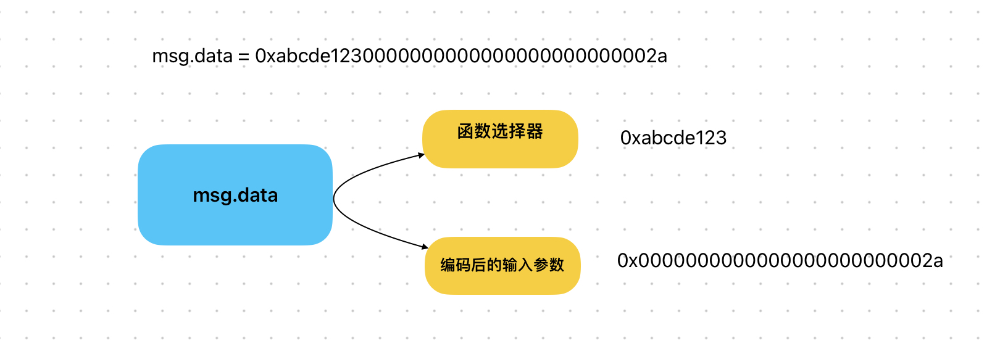

# Content/概念

### Concept

在前面我们学习了 msg.value 这个全局变量，用于获取调用者附加的以太币价值。现在让我们继续学习 *msg* 中的全局变量 *msg.data*。

msg.data **是一个 *bytes* 类型，它包含了函数调用的原始数据。通过使用 *msg.data*，您可以访问传递给函数的原始字节数据，进而进行解析和处理。



- 比喻
    
    假设你在一家快餐店点餐，快餐店是智能合约，你是与合约互动的用户。你可能会说：“我要一个巨无霸套餐，加大薯条，可乐换成雪碧。”这句话就类似于 msg.data，它告诉快餐店（智能合约）你要执行的操作，以及相关的参数（巨无霸套餐、加大薯条、可乐换成雪碧）。
    
- 真实用例
    
    参考OpenZeppelin 的[***Context](https://github.com/OpenZeppelin/openzeppelin-contracts/blob/9ef69c03d13230aeff24d91cb54c9d24c4de7c8b/contracts/utils/Address.sol#L105)*** 合约。
    
    ```solidity
    abstract contract Context {
        function _msgSender() internal view virtual returns (address) {
            return msg.sender;
        }
    
        function _msgData() internal view virtual returns (bytes calldata) {
            return msg.data;
        }
    }
    ```
    
    在 ***Context*** 合约中，通过***_msgData*** 函数提供了一个间接的方式来获取这些数据，这样可以为将来的扩展或修改提供更大的灵活性，例如处理元交易。
    

### Documentation

在 Solidity 中，我们可以通过 `msg.data` 全局变量获取函数调用的原始数据。

```solidity
bytes memory data = msg.data;
```

### FAQ

- 为什么需要msg.data？
    
    当你调用合约的函数时，除了传递以太币外，还可以在函数调用中传递其他数据。这些数据可以是任何类型，包括字符串、字节数组等。通过使用msg.data，您可以访问这些传递的数据，并在合约中执行相应的逻辑。
    

# Example/示例代码

```solidity
pragma solidity ^0.8.0;

contract DataContract {
		bytes data;
    function process() public returns (bytes memory) {
				// 获取函数调用的原始数据
		    data = msg.data;
		    
		    // 执行对data的处理逻辑
		    // ...
		    
		    // 如果需要，可以将data解析为函数签名和参数
		    // ...
		    
		    return data;
		}
}
```