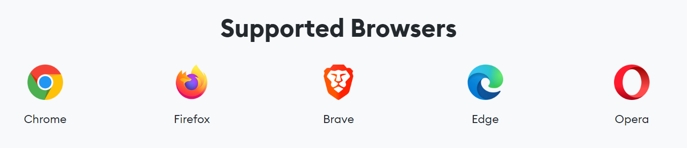
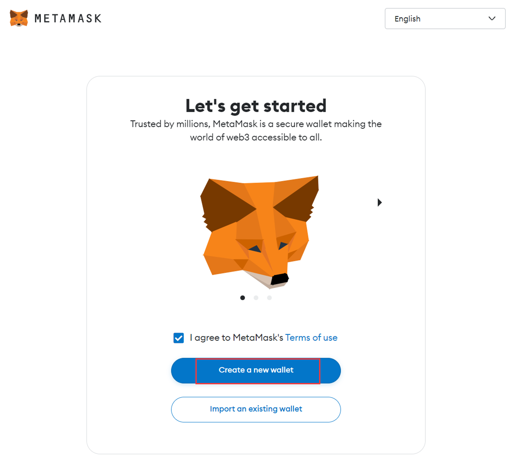
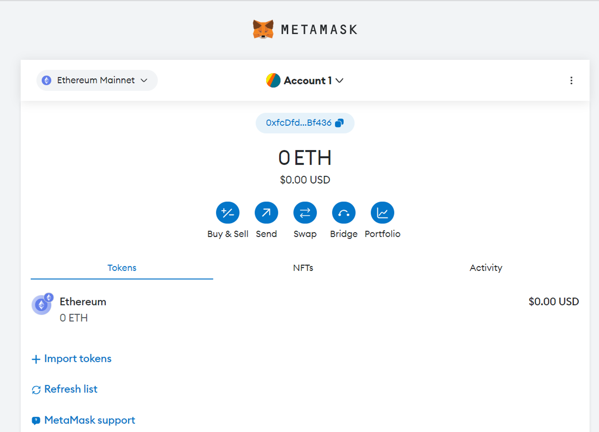

# Install MetaMask

# Content/ **Get started**

### **Install MetaMask for your browser**

In this tutorial, we use the Chrome extension to install **MetaMask**, which is an extremely easy way to do so.

Currently, these browsers support the **MetaMask** plugin.

- Chrome
- Firefox
- Edge
- Brave
- Opera

Also, you can visit each browser's extension store and search for **MetaMask** to see if it supports **MetaMask** or not.

> Caution: Download the official MetaMask app from the app store on your device, not from other sources. Cloned versions outside may capture your mnemonic phrase during generation, posing a threat to your digital asset security through unauthorized access to your private key.
> 

### Create Crypto Wallet

After installing **MetaMask**, we began creating our crypto wallet.

After entering your account credentials and saving the mnemonic phrase (which cannot be displayed here, and please do not disclose it casually), our wallet is now successfully created. 

Congratulations! You now have a MetaMask wallet with a default account.

# Content/ Intro

A digital wallet is a means for storing and managing your identity, represented by digital keys. You need these keys to do anything on a blockchain—**connect to a dapp**, **send or receive crypto**, **buy or sell NFTs**, etc. Think of your wallet as a web3 permissions manager, where you grant access to the apps that you want to use.

The moment your crypto wallet is created, a unique phrase is generated, known as your ‘Secret Recovery Phrase’ (SRP) or ‘seed phrase’. It’s a cryptographic master password that you need to keep secret. This is the seed from which your digital public addresses and private keys sprout—one pair for every account you generate in MetaMask.Your crypto wallet manages both these keys to allow you to transact easily on the Ethereum blockchain.

