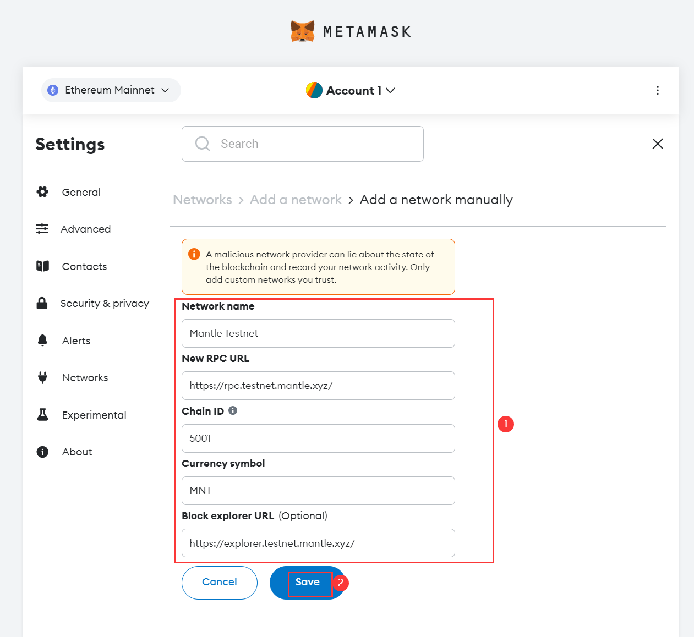

# Network configuration

# Content/ Network configuration

In addition to the default networks, we can manually add networks we want to interact with. Here, we've chosen Mantle for its low gas consumption and fast transaction confirmation—making it an excellent choice. Network configuration details can usually be found in the developer documentation or operational guides. Explore Mantle's documentation [here](https://docs.mantle.xyz/network/for-devs/developing-on-mantle).

Let's configure the network!

- steps
    1. From the homepage of your wallet, click on the network selector in the top left, and then on '**Add network**':
        
        
        
        
        
    2. From here, you should see a list of popular networks ready to add (unless you've added the network already). Tap 'Add a network manually' to start the process, and follow the prompts.
        
        
        
    3. According to the configuration information provided in the [Mantle documentation](https://docs.mantle.xyz/network/for-devs/developing-on-mantle), complete the fields and click 'Save' to add the network.
        
        
        
    4. After performing the above steps, you will be able to see the custom network the next time you access the network selector. We can switch the network here, from the **Ethereum Mainnet** to the **Mantle**, and subsequent operations will be carried out on the Mantle!
        
        
        

# Content/Mantle Network Details

