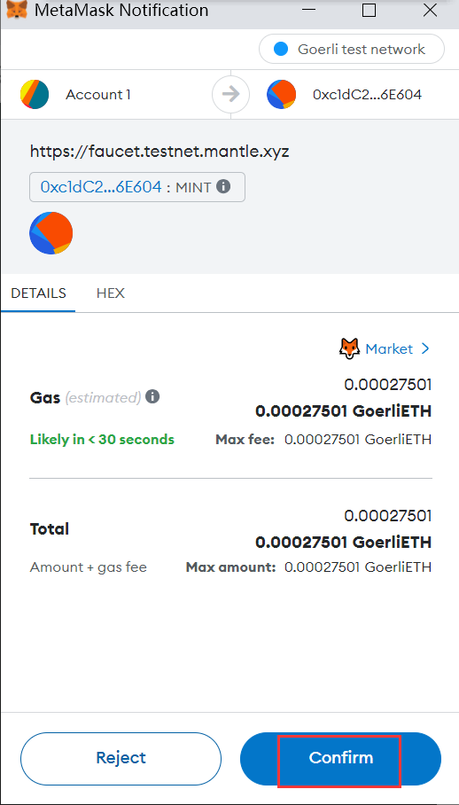

# Get Token

# Content/Get MNT

1. After switching to the Mantle network, we can see the balance of our account on the current network. Obviously, the current MNT is 0. 
    
    
    
2. To acquire additional tokens for subsequent transactions, you can mint some MNT from the [Mantle faucet](https://faucet.testnet.mantle.xyz/). (Of course, asking your friends to send you some MNT is also a good idea!)
    
    
    
    In this [officially provided faucet](https://faucet.testnet.mantle.xyz/), we need to do the following steps:
    
    - Authenticate with your Twitter account.
        
        
        
    - Connect your wallet
        
        
        
    - Switch to the Goerli network and own some **GoerliETH**
    - get GoerliETH
        1. We can see that the faucet requires us to have **GoerliETH** to mint MNT, so let's first add and switch to the Goerli network.
            
            
            
        2. Clearly, the **GoerliETH** is not present in the newly created account, but it's okay. 
            
            
            
            We can go to these faucets to claim tokens.
            
            [https://faucet.goerli.mudit.blog](https://t.co/F2T0xmCPkh) 
            
            [https://goerlifaucet.com](https://t.co/g2mAgekXbA) 
            
            [https://allthatnode.com/faucet/ethereum.dsrv…](https://t.co/kBXmLVQVEf) 
            
            [https://faucets.chain.link/goerli](https://t.co/ZIypbm8cby) 
            
            [https://app.mycrypto.com/faucet](https://t.co/rxw0JZ3xJx) 
            
            [https://faucet.paradigm.xyz](https://t.co/ea6DEMNatO) 
            
            [https://grabteeth.xyz](https://t.co/G9rYItOIYO)
            
            <aside>
            💡 If you can't obtain tokens from these faucets, you can also reach out to our good friends on **Discord** in **HackQuest** to send you some GoerliETH. (Clearly, that's what I did, and my good friend Harry Zhang was happy to assist me.)
            
            </aside>
            
    - mint Mantle token
        
        
        
        
        
        
        
    - Enter the [testnet bridge](https://bridge.testnet.mantle.xyz/deposit), connect your wallet and switch to the Goerli to deposit the MNT we minted before.
        
        
        
        
        
    - After waiting about 12 minutes for the MNT to be transferred, we now switch back to the Mantle network.
        
        
        
        
        
    - Well done, we have MNT now!
        
        
        
    
       
    

# Content/ Link summary

- Mantle
    
    **Faucet:** [https://faucet.testnet.mantle.xyz/](https://faucet.testnet.mantle.xyz/)
    
    **Bridge:** [https://bridge.testnet.mantle.xyz/deposit](https://bridge.testnet.mantle.xyz/deposit)
    
- Goerli
    
    **Faucet:**
    
    [https://goerlifaucet.com](https://t.co/g2mAgekXbA) 
    
    [https://allthatnode.com/faucet/ethereum.dsrv…](https://t.co/kBXmLVQVEf) 
    
    [https://faucets.chain.link/goerli](https://t.co/ZIypbm8cby) 
    
    [https://app.mycrypto.com/faucet](https://t.co/rxw0JZ3xJx) 
    
    [https://faucet.paradigm.xyz](https://t.co/ea6DEMNatO) 
    
    [https://grabteeth.xyz](https://t.co/G9rYItOIYO)
    
    [https://faucet.quicknode.com/drip](https://faucet.quicknode.com/drip)
    