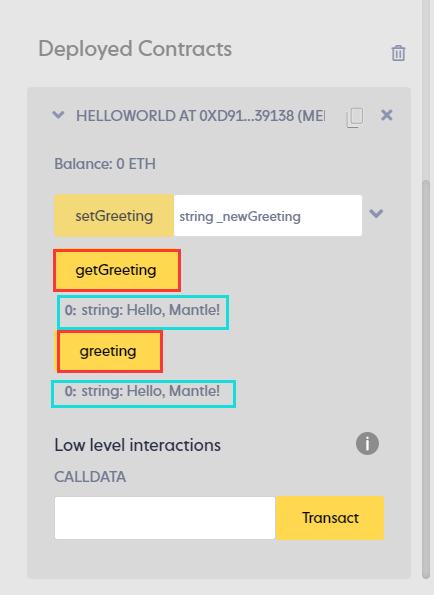

# Deploy your first contract

# Content/Deploy

Sure! Currently, our wallet has a certain **MNT**, and we can try using these tokens to perform some simple operations, such as deploying a smart contract on the Mantle.

Usually, there are several basic steps for contract deployment:

- Write a simple *smart contract*
    
    > For demonstration, we provide a simple ***HelloWorld** contract* here.
    > 
- Test the contract
- Click Try it out button to open HackQuest IDE
- Deploy on Remix VM
    1. Compile the *contract*.
        
        
        
    2. Use Remix VM to deploy the contract, here we choose Remix VM (Shanghai)**.**
        
        
        
    3. Test ***get***.
        
        
        
    4. Test ***set***.
        
        
        
        
        
- Deploy contract on BlockChain
- Deploy on Mantle
    1. Compile the *contract*.
        
        
        
    2. Choose Injected Provider - MetaMask to connect the wallet.
        
        
        
    3. Click “**Deploy**” and confirm the transaction.
        
        
        
- Verify the deployment of the contract.
- Query Contract in Blockchain Explorer.
    
    Congratulations! With the successful deployment, we now have a contract that is truly on the blockchain. It will permanently run on the **blockchain**, and we can view the corresponding *contract* information using the contract address in [the blockchain explorer provided by Mantle](https://explorer.testnet.mantle.xyz/)!
    
    
    
    
    
    
    

# Example/Code

```solidity
// SPDX-License-Identifier: MIT
pragma solidity ^0.8.17;

contract HelloWorld {
    string public greeting;

    constructor() {
        greeting = "Hello, HackQuest!";
    }

    function getGreeting() public view returns (string memory) {
        return greeting;
    }

    function setGreeting(string memory _newGreeting) public {
        greeting = _newGreeting;
    }
}
```