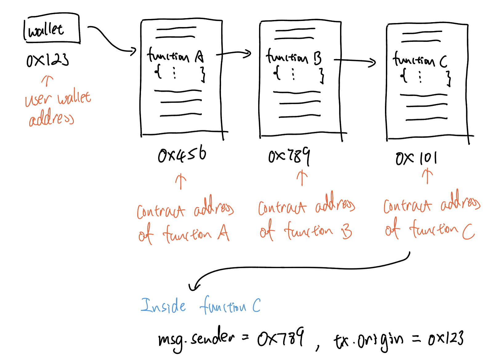

# Content/Content

### Concept

Remember we said that every *function* needs to be called to execute, then how do we know who is the caller? 

msg.sender is the direct caller of the *function*.  ****

- Metaphor
    
    In Solidity, msg.sender is like the return address on a physical envelope, indicating the originator of a message (transaction) sent to the smart *contract's address*.
    
- Real Use Case
    
    ```solidity
    function queueTransaction(
        address target,
        uint256 value,
        string memory signature,
        bytes memory data,
        uint256 eta
    ) public returns (bytes32) {
        require(msg.sender == admin, "Timelock::queueTransaction: Call must come from admin.");
        ...
    }
    ```
    
    The ***[queueTransaction](https://github.com/OpenZeppelin/openzeppelin-contracts/blob/9ef69c03d13230aeff24d91cb54c9d24c4de7c8b/contracts/mocks/compound/CompTimelock.sol#L102-L120)** function* in the ***CompTimelock*** contract uses `msg.sender` to query the caller of this particular invocation.”
    

### Documentation

```solidity
function a() {
  //here msg.sender is not defined as state variables
  //nor passed in as parameters, we could just use it
  address a = msg.sender;
}
```

To use the special *variables*, we don’t need to define them. It’s available all over the function, representing the caller of the function.

 

### FAQ

- **msg.sender** VS **tx.origin**
    
    Since we mentioned that msg.sender is the direct caller of the *function*, then we may wonder, what we mean by the direct caller. 
    
    Think of a use case, where I, the user, with my wallet address *0x123*, called a *function **A***, then ***A*** called ***B*** and ***B*** called ***C***. Three *functions* in three different *contracts*.
    
    For *function **C***, *msg.sender* would be *function **B***’s *contract* address, while *tx.origin* would be *0x123*, which is my wallet address because *tx.origin* represents the **account address** that initialized the entire calling chain in the first place. 
    
    
    
    <aside>
    💡 For the complete list of special *variables*, check [https://docs.soliditylang.org/en/v0.8.19/units-and-global-variables.html#block-and-transaction-properties](https://docs.soliditylang.org/en/v0.8.19/units-and-global-variables.html#block-and-transaction-properties)
    
    </aside>
    

# Example/Example

```solidity
pragma solidity ^0.8.4;
contract VendingMachine {
  address a = address(0x123);
  function buy(uint amount) public payable {
    require(
      a == msg.sender,
      "Not authorized."
    );
    // Execute the purchase.
  }
}
```
