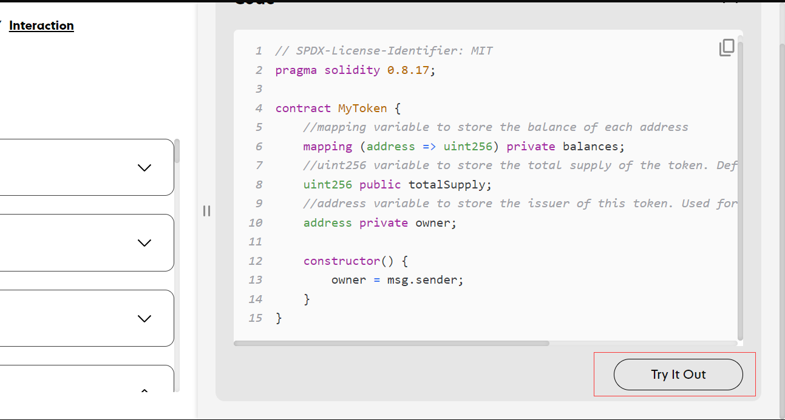
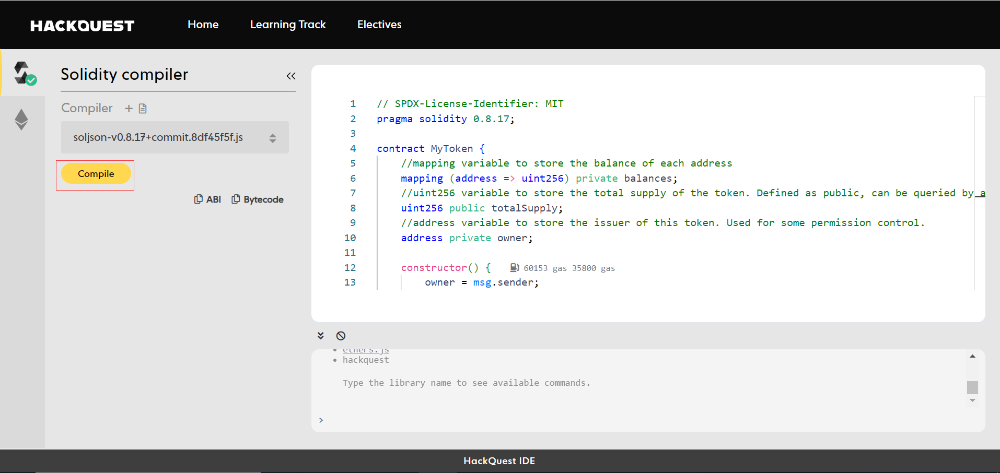
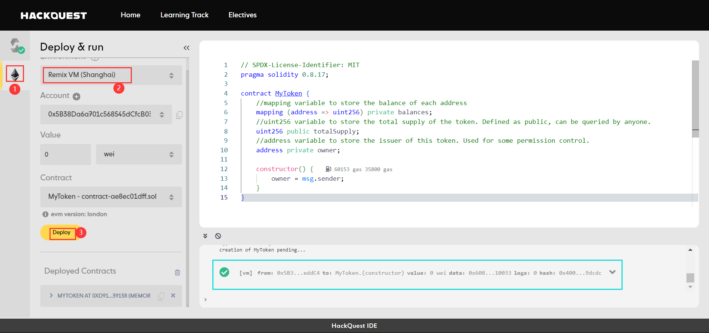
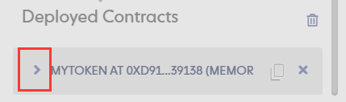
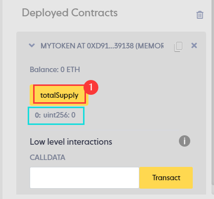
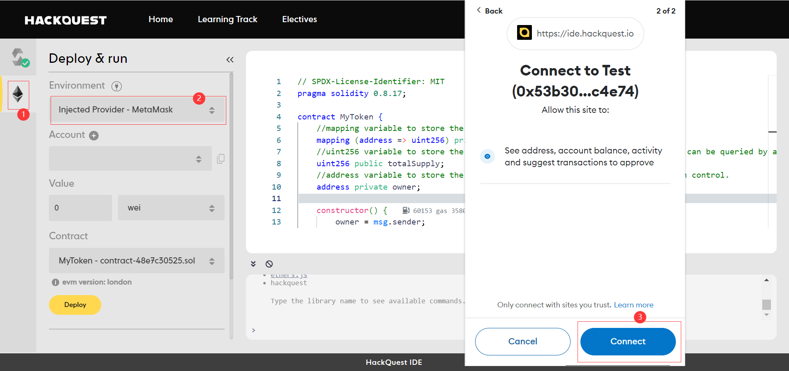
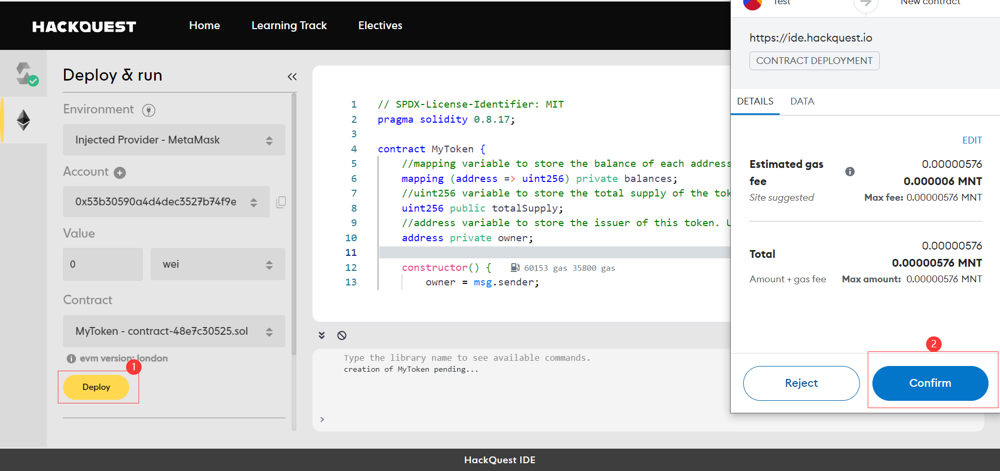
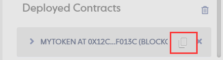
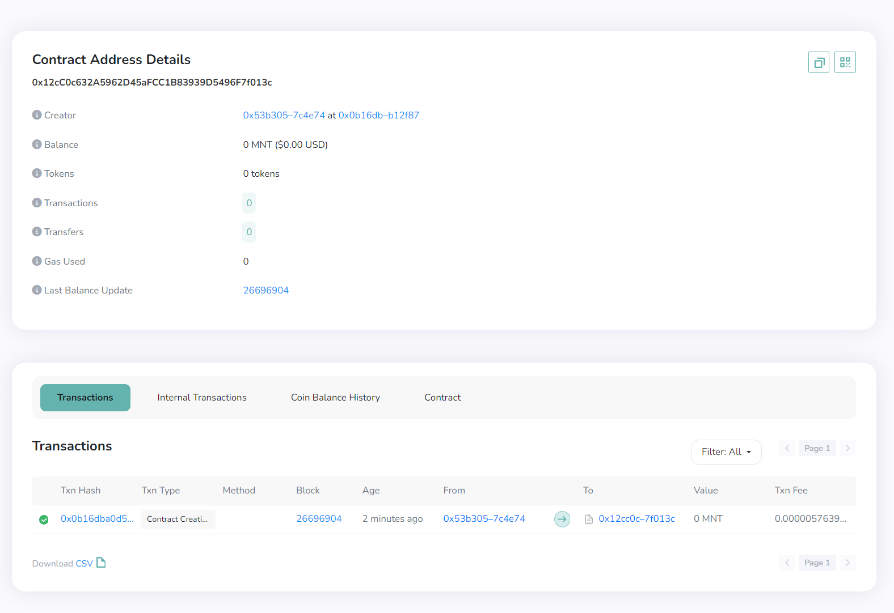

# Content/Open IDE



1. Open **HackQuest IDE**.
    
    > Click the Try it Out button under the example code.
    > 

# Content/Compile



1. Click **Compile** to compile the *contract*.

> Once the first box on the left shows a green checkmark, it means that our *contract* has been compiled and can be deployed.
> 

# Content/Deploy on Remix VM



1. Click on the second icon on the left.
2. Deploy the ***MyToken.so*l**.

> We test the contract locally using **Remix VM** before deploying it on the **blockchain** to minimize gas consumption. Once deployed, the *contract* cannot be modified, so deployment requires careful consideration.
> 

# Content/Open Interface



1. Open the dropdown menu of the ***Mytoken*** contract*.*

# Content/Test totalSupply



1. Click the ***totalSupply*** button to query the total minted token.
    
    > It should be 0 as indicated by “0: uint256:0” the first 0 means this is the first return value because in computer science the counting starts from 0
    > 
    

# Content/Connect Account

> Excellent! *Contract* testing is done, and it's error-free. Now, let's deploy it to the **blockchain**! (Skip if no immediate deployment is needed.)
> 
> 
> Before deployment, connect your wallet. This tutorial uses **MetaMask**, so make sure it's installed in your browser.
> 



1. Click on the second icon on the left.
2.  Connect Metamask.

# Content/Deploy on Mantle

After connecting your wallet, we're set to deploy the *contract* on the **specified network**, here we choose **Mantle**. Make sure your wallet is configured for Mantle, and the connected account in the IDE has enough MNT tokens. (For detailed instructions, check our previous tutorials.)



1. Deploy the ***MyToken.so*l**.
2. Confirm the *transaction*.

# Content/Query Contract

> This is a contract deployed on the blockchain! You can check contract details in the Mantle blockchain explorer.
> 





1. Copy the deployed *contract* address from Deployed *Contracts*.
2. Open the [Mantle Blockchain Explorer](https://explorer.testnet.mantle.xyz/) to query contract details.

# Example/Code

```solidity
// SPDX-License-Identifier: MIT
pragma solidity 0.8.17;

contract MyToken {
    //mapping variable to store the balance of each address
    mapping (address => uint256) private balances;
    //uint256 variable to store the total supply of the token. Defined as public, can be queried by anyone.
    uint256 public totalSupply;
    //address variable to store the issuer of this token. Used for some permission control.
    address private owner;

    constructor() {
        owner = msg.sender;
    }
}
```