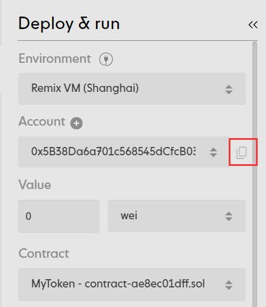
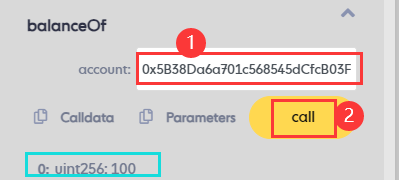
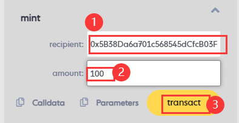
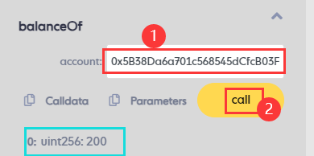
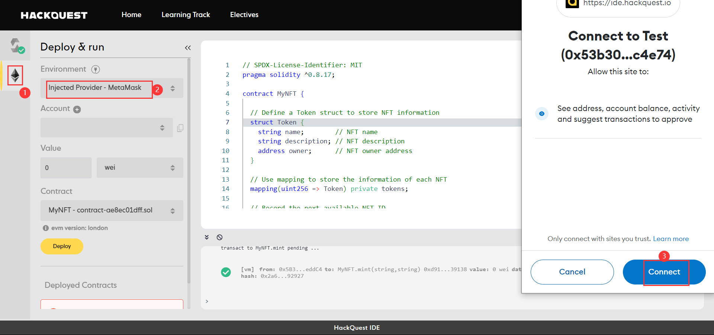
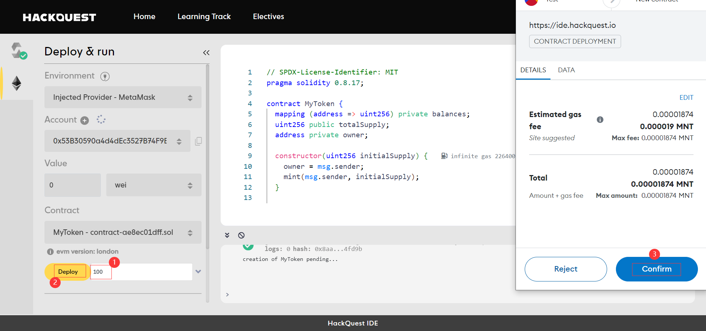
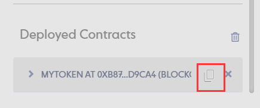
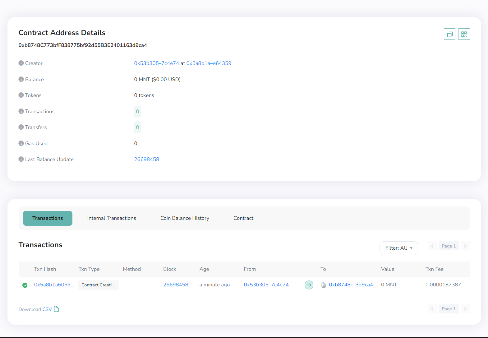

# Content/Deploy on Remix VM


1. Enter *100* tokens as the parameter.
2. Deploy the ***Mytoken** contract.* 

# Content/Copy address



1. Copy the address of the deployer’s account.

# Content/Check balance



1. Find the ***balanceOf*** *function*, and paste the address into the box.
2. Click on "Call".
3. You can find the `return` value as *100*. 

# Content/Mint



1. Paste the address to the first parameter of the ***mint*** function. 
2. Put *100* as the amount.
3. Click on transact.

# Content/Check balance again



1. Find the ***balanceOf*** *function*, no change in parameter, Click on "Call".
2. You can find the `return` value as *200*. 

# Content/Connect Account

> Excellent! *Contract* testing is done, and it's error-free. Now, let's deploy it to the **blockchain**! (Skip if no immediate deployment is needed.)
> 
> 
> Before deployment, connect your wallet. This tutorial uses **MetaMask**, so make sure it's installed in your browser.
> 



1. Click on the second icon on the left.
2.  Connect Metamask.

# Content/Deploy on Mantle

After connecting your wallet, we're set to deploy the *contract* on the **specified network**, here we choose **Mantle**. Make sure your wallet is configured for Mantle, and the connected account in the IDE has enough MNT tokens. (For detailed instructions, check our previous tutorials.)



1. Deploy the ***MyToken.so*l**.
2. Confirm the *transaction*.

# Content/Query Contract

> This is a contract deployed on the blockchain! You can check contract details in the Mantle blockchain explorer.
> 






1. Copy the deployed *contract* address from Deployed *Contracts*.
2. Open the [Mantle Blockchain Explorer](https://explorer.testnet.mantle.xyz/) to query contract details.

# Example/Code

```solidity
// SPDX-License-Identifier: MIT
pragma solidity 0.8.17;

contract MyToken {
  mapping (address => uint256) private balances;
  uint256 public totalSupply;
  address private owner;

  constructor(uint256 initialSupply) {
    owner = msg.sender;
    mint(msg.sender, initialSupply);
  }

  function mint(address recipient, uint256 amount) public {
    require(msg.sender == owner, "Only the owner can perform this action");
    balances[recipient] += amount;
    totalSupply += amount;
  }

  function balanceOf(address account) public view returns (uint256) {
    return balances[account];
  }
}
```