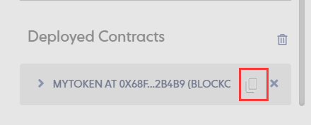
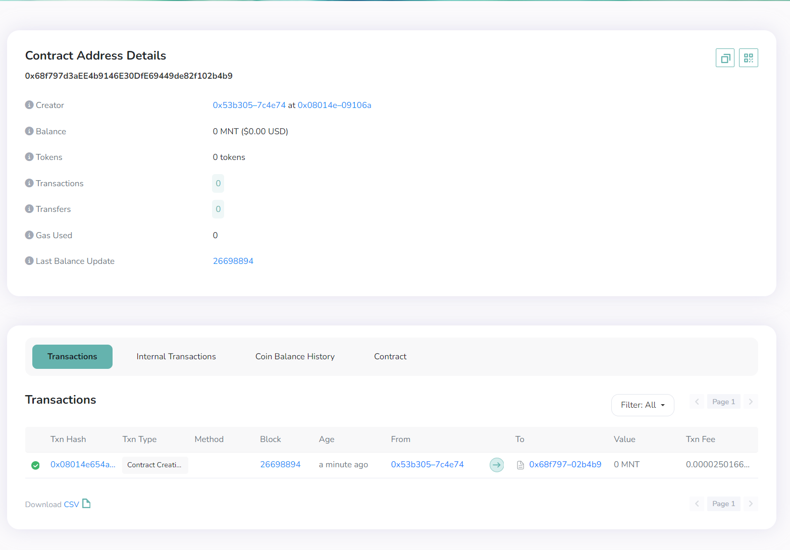

# Content/Deploy on Remix VM


1. Enter *100* tokens as the parameter.
2. Deploy the ***Mytoken** contract.* 

# Content/Switch account


1. Copy the address of the second account.

# Content/transfer


1. Paste the address to the recipient section.
2. Enter *50* to the amount section.
3. Call on “transact”.

# Content/Check balance


1. Find the ***balanceOf*** *function*, copy and paste the receiver’s account address into the section.
2. Click on "Call"
    
    > It should be *50*.
    > 

# Content/Check balance


1. Find the ***balanceOf*** *function*, copy and paste the sender’s account *addresses* into the section.
2. Click on "Call"
    
    > It should also be *50*!
    > 

# Content/Connect Account

> Excellent! *Contract* testing is done, and it's error-free. Now, let's deploy it to the **blockchain**! (Skip if no immediate deployment is needed.)
> 
> 
> Before deployment, connect your wallet. This tutorial uses **MetaMask**, so make sure it's installed in your browser.
> 


1. Click on the second icon on the left.
2.  Connect Metamask.

# Content/Deploy on Mantle

After connecting your wallet, we're set to deploy the *contract* on the **specified network**, here we choose **Mantle**. Make sure your wallet is configured for Mantle, and the connected account in the IDE has enough MNT tokens. (For detailed instructions, check our previous tutorials.)


1. Deploy the ***MyToken.so*l**.
2. Confirm the *transaction*.

# Content/Query Contract

> This is a contract deployed on the blockchain! You can check contract details in the Mantle blockchain explorer.
> 






1. Copy the deployed *contract* address from Deployed *Contracts*.
2. Open the [Mantle Blockchain Explorer](https://explorer.testnet.mantle.xyz/) to query contract details.

# Example/Code

```solidity
// SPDX-License-Identifier: MIT
pragma solidity 0.8.17;

contract MyToken {
  //mapping used to store the balance corresponding to each address
  mapping (address => uint256) private balances;
  //A uint256 variable is used to store the total supply of the token. It is defined as public and can be queried by anyone.
  uint256 public totalSupply;
  //An address variable is used to store the issuer of this token. This is used for some permission control.
  address private owner;

  constructor(uint256 initialSupply) {
    owner = msg.sender;
    mint(msg.sender, initialSupply);
  }
  //function used to mint tokens
  function mint(address recipient, uint256 amount) public {
    //Permission control is implemented
    require(msg.sender == owner,"Only the owner can perform this action");
    balances[recipient] += amount;
    totalSupply += amount;
}
  //A function used to query the balance corresponding to an address
  function balanceOf(address account) public view returns (uint256) {
    return balances[account];
  }
  //A function used to transfer
  function transfer(address recipient, uint256 amount) public returns (bool) {
    require(amount <= balances[msg.sender], "Not enough balance.");
    balances[msg.sender] -= amount;
    balances[recipient] += amount;
    return true;
  }
}
```