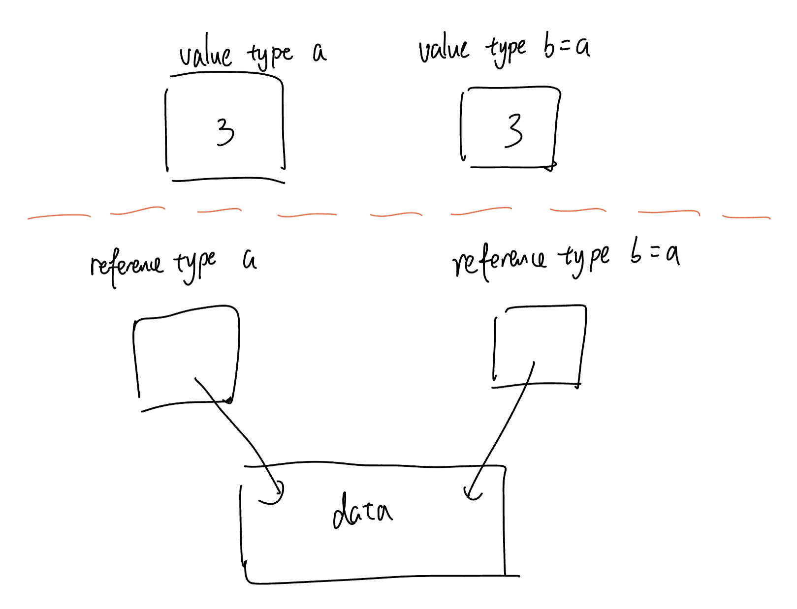

# Content/Content

### Concept

So far, we’ve learned four *variable types*, int, bool, address, and mapping. However, these *variable types* are not all the same. 

They could be divided into two categories: **Value type** and **Reference type**. 

- **Value type:** Variables that store the actual data, such as int, bool, and address.
- **Reference Types**: Variables that store a reference to the data's location, like mapping.
- Metaphor
    
    Come back to our shoe box example, a value type means you put a pair of shoes in your box — you store the value in the variables. 
    
    Meanwhile, reference type means you put a note with an address into the shoe box. 
    
    What does that mean? If you assign the value of one variable to another, using “*b = a*” where they are value types, then updating *a* will not effect *b*. However, if they’re **reference type**, then updating a will also update b at the same time. 
    
    
    
- Real Use Case
    
    The ERC20 contract is an **implementation** of the ERC20 token standard, which is widely used for creating fungible tokens on the Ethereum blockchain.
    
    In the ***ERC20*** contract, two variables are particularly relevant to our discussion on value types and reference types: [***_totalSupply***](https://github.com/OpenZeppelin/openzeppelin-contracts/blob/9ef69c03d13230aeff24d91cb54c9d24c4de7c8b/contracts/token/ERC20/ERC20.sol#L43C2-L43C34) and [***_balances***](https://github.com/OpenZeppelin/openzeppelin-contracts/blob/9ef69c03d13230aeff24d91cb54c9d24c4de7c8b/contracts/token/ERC20/ERC20.sol#L39C1-L39C59).
    
    ```solidity
    uint256 private _totalSupply;
    
    mapping(address account => uint256) private _balances;
    ```
    
    1. ***_totalSupply***: This variable represents the total supply of tokens in the contract. In this case, the variable is a value type. When we update the total supply, we directly modify the value stored in the variable.
    2. ***_balances***: This variable is a mapping that associates each account with its token balance. In this case, the mapping is a reference type, while the keys (addresses) and values (uint256) are value types. When we update the balance of an *account*, we modify the value associated with a specific key in the mapping.
    
    These two variables play a crucial role in the functioning of the ERC20 contract. The ***_balances*** mapping is used to keep track of the token balances of each account, the ***_totalSupply*** variable is used to keep track of the total supply of tokens in the contract.
    
    By understanding the differences between value types and reference types, and how they are used in the ERC20 contract, we can gain a deeper understanding of how smart contracts work and how to design them effectively.
    

### Documentation

Among all the *variable types* we learned so far, there is only one reference type. 

```solidity
//These three are value types (we consider 
//uint and int to be integers)
uint a = 10;
int aa = -3;
bool b = true;
address c = address(0x234);

//mapping is a reference type though
mapping(int => mapping(int => address)) map;
```

### FAQ

- What happens when you assign a reference type value to another variable？
    
    Reference types are more complex data types that hold a reference to the location of the data, rather than the data itself. They include data structures like arrays, structs, and mappings. When you assign a reference type to another variable, both variables refer to the same data, and changes to one variable will affect the other.
    

# Example/Example

```solidity
// SPDX-License-Identifier: MIT
pragma solidity ^0.8.0;

contract Example {
  mapping(int256 => address) map;

  function types() public {
    uint256 a = 1;
    uint256 b = a;
    a = 2; //a is updated, but b stays the same
    b = 4; //b is updated, but a stays the same

    map[1] = address(0x123);
  }
}
```
