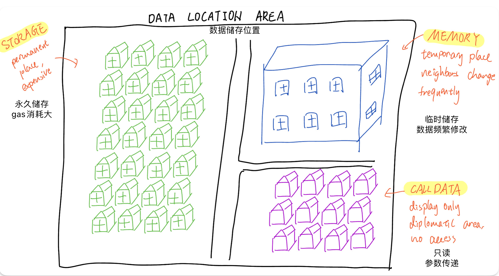

# Content/Content

### Concept

In the previous lesson, we introduced storage as a *data location* in Solidity. Besides storage, there's another essential data location - memory.

Memory in Solidity represents a temporary data storage area. Unlike storage, data stored in memory is not persistent and is lost when a *function call* ends.



- Metaphor
    
    Think of memory as the RAM (Random Access Memory) of a computer. When you're working on a document or browsing the internet, the data you're using gets temporarily stored in RAM. However, once you turn off the computer, the RAM is wiped clean, and the data is lost unless it has been saved to the hard drive.
    
    Similarly, data in the memory location of a Solidity contract is temporary and exists only for the duration of the transaction or function call that is using it. Once the transaction or function call is complete, the memory data is erased. If you want to keep data between transactions, you need to use the storage location.
    
- Real Use Case
    
    In the ERC20 *contract*, the memory *data location* is used for temporary *variables*, such as *function parameters* and *return variables*. 
    
    It's less expensive in terms of gas costs compared to *storage*. 
    
    **Function Parameters**
    For example, in [ERC20](https://github.com/OpenZeppelin/openzeppelin-contracts/blob/9ef69c03d13230aeff24d91cb54c9d24c4de7c8b/contracts/token/ERC20/ERC20.sol#L59C1-L62C6), the ***name_*** and ***symbol_*** *variables* in the *constructor* are stored in memory.
    
    ```solidity
    constructor(string memory name_, string memory symbol_) {
        _name = name_;
        _symbol = symbol_;
    }
    ```
    
    In this use case, the constructor receives the ***name_*** and ***symbol_***, which are stored in memory. Afterward, these values are passed to the ***_name*** and ***_symbol*** state variables, which are storage *variables* and persist on the blockchain. 
    
    This pattern of passing *function parameters* in memory *variables* to storage *variables* is common in smart contracts, and memory provides an efficient way to temporarily hold these values.
    
    **Function Return**
    
    When a *[function](https://github.com/OpenZeppelin/openzeppelin-contracts/blob/9ef69c03d13230aeff24d91cb54c9d24c4de7c8b/contracts/token/ERC20/ERC20.sol#L67C1-L69C6)* returns a reference type variable ***_name*** in storage, it makes a copy of ***_name***, store that copy in memory, and return the copy. 
    
    This avoids directly modifying the storage *variables* and reduces gas costs.
    
    ```solidity
    function name() public view virtual returns (string memory) {
        return _name;
    }
    
    function symbol() public view virtual returns (string memory) {
        return _symbol;
    }
    ```
    

### Documentation

To declare a reference type *variable* in memory, you need to define it within a *function*, followed by the keyword `memory`.

```solidity
contract MemoryExample {
  function example() public pure {
    string memory tempStr = "Hello, World!";
    // tempStr is a local variable stored in memory
  }
}
```

### FAQ

- Why using memory?
    
    Memory is less expensive in terms of gas costs compared to storage as it doesn't involve writing data to the blockchain. 
    
- When to use Memory?
    
    If you're working with temporary variables, especially within *function calls*, memory is the best place to declare them. There’re two scenarios basically.
    
    1. If you don’t need the variable after function termination
    2. The variable involves many operations and are frequently modified

# Example/Example

```solidity
pragma solidity ^0.8.4;

contract MemoryExample {
  string public name;
  uint public score;
  
  function operate() public {
    score = 10;
    name = "Jane";

    // tempName is a temporary variable stored in memory
    string memory tempName = "Joe";
    tempName = name;
  }
}
```
