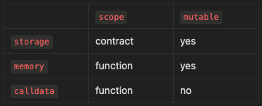

# Content/Content

### Concept

We've already discussed storage and memory. Now let's turn our attention to calldata.

Calldata is an immutable (read-only), temporary location where function arguments are stored, and behaves mostly like memory.



- Metaphor
    
    Think of calldata as a shopping list that you give to a personal shopper. You write down what you need, give the list to the shopper, and they cannot modify it but just use it to pick up the items for you. Once the shopper has collected everything, they no longer need the list, and it can be discarded.
    
    In this analogy:
    
    - **Shopping list** represents calldata.
    - **Personal shopper** represents a *function* in a *smart contract*.
    - **Items on the list** represent the *function parameters*.
    
    You give your shopping list (calldata) to the personal shopper (*function*), who uses it to pick up the items you need (execute the transaction). Once they've got everything, the list is no longer needed and can be thrown away. 
    
    Similarly, calldata is temporary and exists only for the duration of the *function call*.
    
- Real Use Case
    
    The ***ERC20FlashMint*** *contract* provides an implementation of the ERC3156 Flash loans extension, as defined in ERC-3156.
    
    Flash loans are a novel concept in the blockchain world, allowing users to borrow tokens for a short period of time without any collateral. Users are required to return the loaned amount plus a fee within the same transaction, ensuring that the loan is always repaid.
    
    In the ***[flashLoan***](https://github.com/OpenZeppelin/openzeppelin-contracts/blob/9e3f4d60c581010c4a3979480e07cc7752f124cc/contracts/token/ERC20/extensions/ERC20FlashMint.sol#L109C5-L114C38) *function* of the ***ERC20FlashMint*** *contract*, one of the *parameters* is bytes calldata data. 
    
    ```solidity
    function flashLoan(
            IERC3156FlashBorrower receiver,
            address token,
            uint256 value,
            bytes calldata data
    ) public virtual returns (bool) {...}
    ```
    
    Here, calldata is used because ***data*** is an *external* *function parameter*. ***flashLoan*** should not try to modify it.
    

### Documentation

To declare a calldata *parameter*, we use the keyword `calldata`.

```solidity
contract CalldataExample {
  function operate(string calldata data) public pure {
    // data is a parameter stored in calldata
  }
}
```

### FAQ

- Why use calldata?
    
    The benefits of using calldata include:
    
    - **Gas Efficiency**: *Calldata* is cheaper in terms of gas cost as it is read-only and does not make permanent changes to the blockchain.
    - **Security**: *Calldata* is immutable during a function call which ensures that function arguments can't be accidentally modified.
- Calldata VS Memory
    
    The key difference between memory and calldata is that *memory* is a temporary data storage location that can be modified by a function. In contrast, *calldata* is a read-only, used to hold function arguments passed in from an external caller.
    
    ```solidity
    function operate(string calldata name, string memory name2) public {
      string memory newName = name;
      name = "Jane"; //error: data of calldata type cannot be modified
      name2 = "Jane";//this works fine
    }
    ```
    

# Example/Example

```solidity
pragma solidity ^0.8.4;

contract CalldataExample {

  function signUp(string calldata name) public returns (string memory) {
    return name;
  }
}
```
