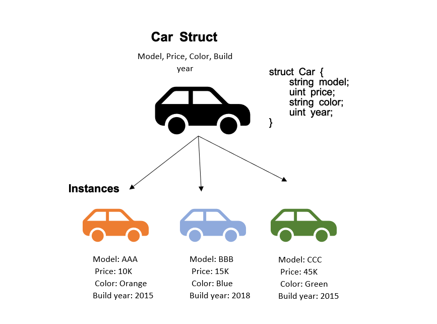

# Content/Content

### Concept

Having introduced the definition of structs in our last lesson, we will now focus on their initialization in Solidity.

To initialize a struct, we create an instance of the struct and set the values for its properties. 

- Metaphor
    
    Imagine you're the owner of a car manufacturing company. Before a car is assembled, you need to define the blueprint for the car, which is equivalent to declaring a struct in Solidity.
    
    In Solidity, you can think of a struct as a blueprint for creating instances of a particular type. It defines what data each instance should hold. In the car manufacturing analogy, the blueprint defines the model, price, color, and build year of the car.
    
    The process of initializing a struct in Solidity is similar to assembling a car at your manufacturing company based on the blueprint.
    
    
    
    Just as each car produced by your manufacturing company follows a blueprint but can have different specifications (model, price, color, build year), each instance of a struct in Solidity follows the same structure but can hold different data.
    
- Real Use Case
    
    Continuing from our previous discussion on the ***ERC20VotesLegacyMock*** contract, let's further explore how the ***[Checkpoint](https://github.com/OpenZeppelin/openzeppelin-contracts/blob/9e3f4d60c581010c4a3979480e07cc7752f124cc/contracts/mocks/token/ERC20VotesLegacyMock.sol#L15)*** struct is initialized and used.
    
    ```solidity
    struct Checkpoint {
        uint32 fromBlock;
        uint224 votes;
    }
    ```
    
    As a reminder, the ***[Checkpoint](https://github.com/OpenZeppelin/openzeppelin-contracts/blob/9e3f4d60c581010c4a3979480e07cc7752f124cc/contracts/mocks/token/ERC20VotesLegacyMock.sol#L15)*** struct records the block number (***fromBlock***) and the number of votes (***votes***) at that block. This allows the contract to track voting history.
    
    In the ***_writeCheckpoint*** function, the ***[Checkpoint](https://github.com/OpenZeppelin/openzeppelin-contracts/blob/9e3f4d60c581010c4a3979480e07cc7752f124cc/contracts/mocks/token/ERC20VotesLegacyMock.sol#L15)*** struct is initialized and populated.
    
    ```solidity
    function _writeCheckpoint(
        Checkpoint[] storage ckpts,
        function(uint256, uint256) view returns (uint256) op,
        uint256 delta
    ) private returns (uint256 oldWeight, uint256 newWeight) {
        uint256 pos = ckpts.length;
    		oldWeight = oldCkpt.votes;
        newWeight = op(oldWeight, delta);
    		Checkpoint memory oldCkpt = pos == 0 ? Checkpoint(0, 0) : _unsafeAccess(ckpts, pos - 1);
    		    
    		if (pos > 0 && oldCkpt.fromBlock == block.number) {
            ......
        } else {
            ckpts.push(
               Checkpoint({fromBlock: SafeCast.toUint32(block.number), votes: SafeCast.toUint224(newWeight)})
            );
    	   }
    }
    ```
    
    In this function, a new checkpoint is initialized and populated based on the previous checkpoint and the change in votes (***delta***). If the last checkpoint was recorded in the current block, the votes in that checkpoint are updated. Otherwise, a new ***[Checkpoint](https://github.com/OpenZeppelin/openzeppelin-contracts/blob/9e3f4d60c581010c4a3979480e07cc7752f124cc/contracts/mocks/token/ERC20VotesLegacyMock.sol#L15)*** struct is initialized with the current block number and new weight of votes and added to the checkpoints array.
    
    This continued use of struct initialization in the ***ERC20VotesLegacyMock*** contract demonstrates how structs can be employed to efficiently store and manage complex data in Solidity smart contracts. In this case, it provides a robust method to track the voting history for each account, allowing for greater transparency and traceability in the voting process.
    

### Documentation

```solidity
struct StructName {
  string property1;
  uint property2;
}

StructName instance = StructName(value1, value2);
```

To initialize a struct, we should use the struct name followed by the values for its properties in parentheses. 

### FAQ

- How to create a Struct instance？
    
    When we create a struct instance, each property within the struct is assigned a value. Referring to the previous example, we can create an instance of a car, namely '***tesla***', and concurrently assign values to the parameters within the ***Car*** struct: model, price, color, and year.
    
    ```solidity
    Car tesla = Car("ModelY", 300000, "white", 2023);
    ```
    
- When we initialize an instance of a struct, where do we need to store it: Storage, Memory, or Calldata?
    
    Struct is a reference type, which means for each instance we initialized, we need to store it either in Storage, Memory, or Calldata. 
    

# Example/Example

```solidity
// SPDX-License-Identifier: MIT
pragma solidity ^0.8.4;

contract StructExample {

  struct Student{
    string name;
    uint studentId;
  }

  Student public a = Student("Jane", 100);
  Student public b = Student("Luca", 200);
}
```
